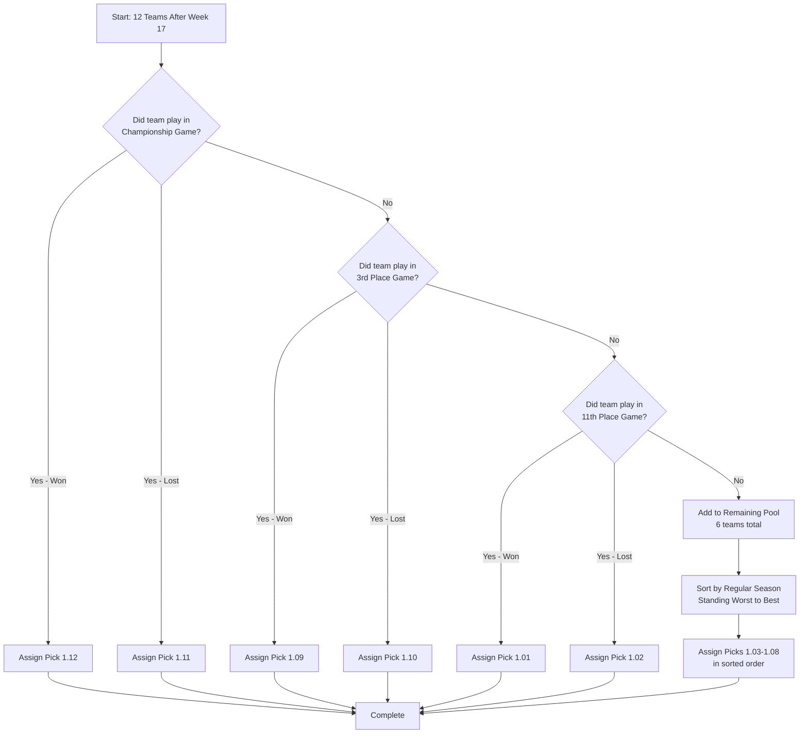
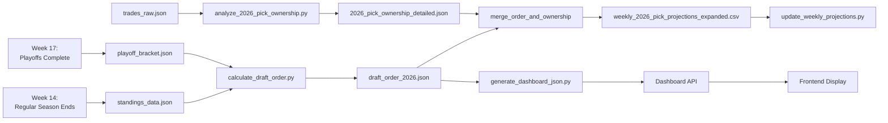

# Draft Order and Week Configuration System Design

**Date:** December 29, 2024
**Status:** ✅ Design Complete - Implementation Integrated
**Purpose:** Define the automated draft order determination system and week configuration requirements

> **Note:** Draft order projection feature implemented. See [`dashboard/frontend/src/pages/DraftOrderProjection.tsx`](../dashboard/frontend/src/pages/DraftOrderProjection.tsx) and [`pipeline/scripts/calculate_progressive_draft_order.py`](../pipeline/scripts/calculate_progressive_draft_order.py).

**📊 Companion Document:** [`PROGRESSIVE_DRAFT_ORDER_TRACKING.md`](PROGRESSIVE_DRAFT_ORDER_TRACKING.md) - Progressive determination and dashboard design

---

## Table of Contents

1. [Executive Summary](#1-executive-summary)
2. [Draft Order Rules](#2-draft-order-rules)
3. [Algorithm Specification](#3-algorithm-specification)
4. [Data Requirements](#4-data-requirements)
5. [Week Configuration Requirements](#5-week-configuration-requirements)
6. [Implementation Design](#6-implementation-design)
7. [Integration Points](#7-integration-points)
8. [Test Cases](#8-test-cases)
9. [Phased Implementation Plan](#9-phased-implementation-plan)
10. [Progressive Determination](#10-progressive-determination)

---

## 1. Executive Summary

### Problem Statement

The current system lacks automated draft order determination rules. From [`docs/2026_PICK_TRACKING_AND_WEEK_CONFIG_ANALYSIS.md`](../docs/2026_PICK_TRACKING_AND_WEEK_CONFIG_ANALYSIS.md):

> **Critical Gap:** No automated draft order determination rules
> - Automated tier assignment based on final standings: ❌ Missing
> - Draft order calculation logic: ❌ Missing  
> - Integration of playoff performance: ❌ None
> - 1st round picks: ❌ Manual - Cannot automate updates

### Solution Overview

Implement an automated draft order determination system that:
- ✅ Calculates final draft order based on regular season standings and playoff results
- ✅ Assigns specific pick numbers (1.01-1.12, 2.01-2.12, etc.) to each team
- ✅ Integrates with existing pick ownership tracking system
- ✅ Updates weekly projections with accurate tier assignments
- ✅ Handles edge cases and tiebreakers consistently

### Key Deliverables

1. **Draft Order Calculation Script** - Automated determination of picks 1-12 for each round
2. **Week Configuration Enhancement** - Support for playoff week tracking
3. **Updated Weekly Projections** - Include 1st round tier assignments
4. **Validation Framework** - Test cases and historical season validation

---

## 2. Draft Order Rules

### Official League Rules

**Draft Structure:**
- **Timing:** Rookie draft prior to start of each league season
- **Format:** Linear draft (same order each round)
- **Rounds:** Four rounds (48 total picks for 12 teams)
- **Eligibility:** Rookies only

**Order Determination:** Based on final regular season standings + playoff game results

### Pick Assignment Formula

| Pick | Assignment Rule | Example Team |
|------|----------------|--------------|
| **1.01** | Winner of 11th place game (Toilet Bowl) | Team that finished 11th in regular season, won consolation final |
| **1.02** | Loser of 11th place game (Toilet Bowl) | Team that finished 12th in regular season, lost consolation final |
| **1.03** | Lowest remaining regular season finish* | Team that finished 10th (if didn't make 11th place game) |
| **1.04** | 2nd lowest remaining regular season finish* | Team that finished 9th |
| **1.05** | 3rd lowest remaining regular season finish* | Team that finished 8th |
| **1.06** | 4th lowest remaining regular season finish* | Team that finished 7th |
| **1.07** | 5th lowest remaining regular season finish* | Team that finished 6th |
| **1.08** | 6th lowest remaining regular season finish* | Team that finished 5th |
| **1.09** | Winner of 3rd place game | Team that lost in semifinals, won 3rd place game |
| **1.10** | Loser of 3rd place game | Team that lost in semifinals, lost 3rd place game |
| **1.11** | Championship game loser | Team that finished 2nd in league |
| **1.12** | Championship game winner | Team that finished 1st in league |

\* **"Remaining"** = Excluding the 6 teams that play in Championship, 3rd Place, and 11th Place games

### Key Principles

1. **Regular Season Standing is Primary**
   - Final standings after Week 14 determine base order
   - Tiebreaker: Total Points For (higher PF = better standing)

2. **Playoff Games Swap Specific Pairs**
   - Championship: Positions 1-2
   - 3rd Place: Positions 3-4  
   - 11th Place: Positions 11-12
   - Winners get worse picks (reward mediocrity/punish success)

3. **Middle Picks (1.03-1.08) Purely Regular Season**
   - These teams did NOT play in the three special games
   - Order determined entirely by Week 14 final standings
   - Reverse order (worst regular season finish gets best pick)

---

## 3. Algorithm Specification

### High-Level Algorithm

```python
def calculate_draft_order(regular_season_standings, playoff_results):
    """
    Calculate final draft order for all 12 teams.
    
    Args:
        regular_season_standings: List of teams ranked 1-12 after Week 14
        playoff_results: Dict containing championship, 3rd place, 11th place game results
    
    Returns:
        Dict mapping pick_number -> team_id for each round
    """
    # Step 1: Identify special game participants
    championship_winner = playoff_results['championship']['winner']
    championship_loser = playoff_results['championship']['loser']
    third_place_winner = playoff_results['third_place']['winner']
    third_place_loser = playoff_results['third_place']['loser']
    toilet_bowl_winner = playoff_results['toilet_bowl']['winner']
    toilet_bowl_loser = playoff_results['toilet_bowl']['loser']
    
    special_game_teams = {
        championship_winner, championship_loser,
        third_place_winner, third_place_loser,
        toilet_bowl_winner, toilet_bowl_loser
    }
    
    # Step 2: Identify remaining teams (for picks 3-8)
    remaining_teams = [
        team for team in regular_season_standings 
        if team not in special_game_teams
    ]
    
    # Step 3: Sort remaining teams by regular season standing (worst to best)
    remaining_teams_sorted = sorted(
        remaining_teams,
        key=lambda t: t.regular_season_rank,
        reverse=True  # Worst standing (highest rank number) gets pick 1.03
    )
    
    # Step 4: Assign draft order
    draft_order = {
        1: toilet_bowl_winner,
        2: toilet_bowl_loser,
        3: remaining_teams_sorted[0],  # Worst remaining team
        4: remaining_teams_sorted[1],
        5: remaining_teams_sorted[2],
        6: remaining_teams_sorted[3],
        7: remaining_teams_sorted[4],
        8: remaining_teams_sorted[5],  # Best remaining team
        9: third_place_winner,
        10: third_place_loser,
        11: championship_loser,
        12: championship_winner
    }
    
    return draft_order
```

### Decision Tree



### Edge Cases and Handling

#### Edge Case 1: Tiebreakers in Regular Season

**Scenario:** Two teams finish with identical W-L records

**Resolution:**
```python
def resolve_regular_season_tie(team_a, team_b):
    """Primary tiebreaker: Total Points For"""
    if team_a.points_for > team_b.points_for:
        return team_a  # Better standing
    elif team_a.points_for < team_b.points_for:
        return team_b
    else:
        # Secondary tiebreaker: Head-to-head record
        # (requires additional data)
        return resolve_h2h_tiebreaker(team_a, team_b)
```

#### Edge Case 2: Division Winner Seeding vs. Standing

**Scenario:** 3-seed division winner finishes 9th in regular season

**Example from 2024:**
- Team "Mostly Washed": 11-17 record, won division, #3 playoff seed
- Lost in Wild Card round (Week 15)
- Did NOT make Championship or 3rd Place game
- **Result:** Gets pick based on regular season standing (#9)

**Implementation:**
```python
# Playoff seeding does NOT affect draft order
# Only playoff RESULTS (which games you play in) matter
# Regular season standing determines order for picks 3-8

if team not in [championship, third_place, toilet_bowl]:
    pick_assignment = based_on_regular_season_standing
```

#### Edge Case 3: Consolation Bracket Structure

**Scenario:** Determining which consolation teams play in 11th place game

**Confirmed Structure:**
The consolation bracket mirrors the playoff bracket structure:

**Week 15 (First Round):**
- Seeds 7-8: Get byes
- Seed 9 vs Seed 12
- Seed 10 vs Seed 11

**Week 16 (Semifinals):**
- Loser of 9v12 plays Loser of 10v11 → **Toilet Bowl (11th Place Game)**
- Winner of 9v12 plays Seed 7
- Winner of 10v11 plays Seed 8

**Week 17 (Finals):**
- Toilet Bowl championship determines picks 1.01 and 1.02
- Consolation championship (for 7th place overall)

**Draft Order Assignment:**
- **1.01**: Winner of Toilet Bowl
- **1.02**: Loser of Toilet Bowl
- **1.03-1.08**: Remaining 6 teams (7, 8, winner of 9v12, winner of 10v11, and 2 other teams) in reverse regular season order

**Implementation:**
```python
def identify_toilet_bowl_teams(consolation_bracket, week_15_results):
    """
    Identify teams playing in Toilet Bowl (11th place game).
    
    Toilet Bowl participants are the LOSERS of the first round
    consolation bracket games (9v12 and 10v11).
    """
    matchup_9v12 = week_15_results['consolation']['9v12']
    matchup_10v11 = week_15_results['consolation']['10v11']
    
    loser_9v12 = matchup_9v12['loser']
    loser_10v11 = matchup_10v11['loser']
    
    return {
        'toilet_bowl_participants': [loser_9v12, loser_10v11],
        'consolation_finalists': [
            week_15_results['consolation']['7'],  # Had bye
            week_15_results['consolation']['8'],  # Had bye
            matchup_9v12['winner'],
            matchup_10v11['winner']
        ]
    }
```

---

## 4. Data Requirements

### Input Data Sources

#### 4.1 Regular Season Final Standings

**Source:** [`pipeline/standings_data.json`](../pipeline/standings_data.json) after Week 14

**Required Fields:**
```json
{
  "roster_id": 7,
  "team_name": "2-Man Title Charge",
  "wins": 22,
  "losses": 6,
  "ties": 0,
  "points_for": 2000.06,
  "points_against": 1802.9,
  "regular_season_rank": 1,  // 1-12 ranking after Week 14
  "division": 3
}
```

**Derivation:**
- Sort all 12 teams by W-L record
- Apply tiebreaker (Points For)
- Assign `regular_season_rank` (1 = best, 12 = worst)

#### 4.2 Playoff Results

**Source:** [`pipeline/playoff_bracket.json`](../pipeline/playoff_bracket.json) after Week 17

**Required Fields:**
```json
{
  "championship": {
    "winner": {"roster_id": 7, "team_name": "..."},
    "loser": {"roster_id": 3, "team_name": "..."}
  },
  "third_place": {
    "winner": {"roster_id": 1, "team_name": "..."},
    "loser": {"roster_id": 6, "team_name": "..."}
  },
  "toilet_bowl": {
    "winner": {"roster_id": 8, "team_name": "..."},
    "loser": {"roster_id": 4, "team_name": "..."}
  }
}
```

**Current Gap:** `playoff_bracket.json` only shows matchups, not final results

**Solution:** Need to fetch final playoff results from Sleeper API after Week 17

#### 4.3 Pick Ownership Mapping

**Source:** [`pipeline/2026_pick_ownership_detailed.json`](../pipeline/2026_pick_ownership_detailed.json)

**Purpose:** Map original pick owners to current owners (after trades)

**Example:**
```json
{
  "1.03": {
    "original_owner": "roster_id_10",
    "current_owner": "roster_id_5",
    "transfer_history": [...]
  }
}
```

### Output Data Structure

#### 4.4 Draft Order Assignment

**Target File:** [`pipeline/draft_order_2026.json`](../pipeline/draft_order_2026.json) (new file)

```json
{
  "season": 2025,
  "draft_year": 2026,
  "calculation_date": "2025-01-05T12:00:00Z",
  "draft_order": {
    "round_1": [
      {
        "pick_number": 1,
        "pick_label": "1.01",
        "original_owner": {
          "roster_id": 8,
          "team_name": "TRIPS 🔥",
          "regular_season_rank": 11,
          "playoff_result": "Won Toilet Bowl"
        },
        "current_owner": {
          "roster_id": 8,
          "team_name": "TRIPS 🔥"
        },
        "tier": "Early"
      },
      {
        "pick_number": 2,
        "pick_label": "1.02",
        "original_owner": {
          "roster_id": 4,
          "team_name": "Spirit Halloween",
          "regular_season_rank": 12,
          "playoff_result": "Lost Toilet Bowl"
        },
        "current_owner": {
          "roster_id": 5,
          "team_name": "Mommy Rainier"
        },
        "tier": "Early",
        "traded": true
      }
      // ... picks 1.03 through 1.12
    ],
    "round_2": [
      // Same structure, tier changes to "Mid"
    ],
    "round_3": [
      // Same structure, tier "Mid"/"Late" boundary
    ],
    "round_4": [
      // Same structure, tier "Late"
    ]
  },
  "tier_definitions": {
    "Early": {"picks": [1, 2, 3, 4], "dynasty_value_multiplier": 1.0},
    "Mid": {"picks": [5, 6, 7, 8], "dynasty_value_multiplier": 0.8},
    "Late": {"picks": [9, 10, 11, 12], "dynasty_value_multiplier": 0.6}
  }
}
```

---

## 5. Week Configuration Requirements

### Current Issue

From [`docs/2026_PICK_TRACKING_AND_WEEK_CONFIG_ANALYSIS.md`](../docs/2026_PICK_TRACKING_AND_WEEK_CONFIG_ANALYSIS.md):

> **The Dual-Week Problem:**
> - Regular season: Week 1-14
> - Playoff rounds: Week 15-17  
> - Single config value cannot serve both needs simultaneously

### Solution: Phase-Based Configuration (Option C)

**Rationale:** Draft order calculation requires knowing:
1. When regular season ends (Week 14)
2. When playoffs complete (Week 17)
3. Current season phase for script behavior

**Recommended Config:** [`pipeline/config/current_week.json`](../pipeline/config/current_week.json)

```json
{
  "season_year": 2024,
  "season_phase": "playoffs",
  "nfl_week": 17,
  "regular_season_week": 14,
  "playoff_week": 3,
  "last_updated": "2024-12-29T10:00:00Z",
  "phase_metadata": {
    "regular_season_complete": true,
    "playoffs_complete": true,
    "draft_order_finalized": false
  }
}
```

**Season Phase Values:**
- `"preseason"` - Before Week 1
- `"regular_season"` - Weeks 1-14
- `"playoffs"` - Weeks 15-17
- `"offseason"` - After Week 17, before next season

**Script Behavior by Phase:**

| Script | Regular Season | Playoffs | Offseason |
|--------|---------------|----------|-----------|
| `update_weekly_projections.py` | Update 2nd-4th rounds | Update 2nd-4th rounds | No-op |
| `calculate_draft_order.py` | Skip (not ready) | Skip (not complete) | **Run after Week 17** |
| `calculate_playoff_scenarios.py` | Run (weeks 1-14) | Skip | Skip |
| `simulate_playoff_scenarios.py` | Skip | Run (weeks 15-17) | Skip |

### Utility Function Enhancement

**File:** [`pipeline/utils/week_config.py`](../pipeline/utils/week_config.py)

```python
def get_current_week(week_type="nfl"):
    """
    Get current week based on context type.
    
    Args:
        week_type: "nfl" (calendar), "regular_season", "playoff"
    
    Returns:
        int: Current week number for specified type
    """
    config = load_week_config()
    
    if week_type == "nfl":
        return config["nfl_week"]
    elif week_type == "regular_season":
        return config["regular_season_week"]
    elif week_type == "playoff":
        return config.get("playoff_week", 0)
    else:
        raise ValueError(f"Unknown week_type: {week_type}")

def get_season_phase():
    """Get current season phase."""
    config = load_week_config()
    return config.get("season_phase", "regular_season")

def is_draft_order_ready():
    """Check if all data needed for draft order calculation is available."""
    config = load_week_config()
    return (
        config.get("season_phase") == "offseason" and
        config.get("phase_metadata", {}).get("playoffs_complete", False)
    )
```

---

## 6. Implementation Design

### 6.1 New Script: `calculate_draft_order.py`

**Location:** [`pipeline/scripts/calculate_draft_order.py`](../pipeline/scripts/calculate_draft_order.py)

**Purpose:** Automated draft order determination after playoff completion

**Workflow:**

```python
#!/usr/bin/env python3
"""
Calculate final draft order for upcoming rookie draft.

Run this script AFTER Week 17 playoffs complete.
Requires:
- Final regular season standings (Week 14)
- Playoff results (Week 17)
- Current pick ownership data

Output: pipeline/draft_order_2026.json
"""

def main():
    # 1. Validate season phase
    if not is_draft_order_ready():
        print("ERROR: Playoffs not complete. Cannot calculate draft order.")
        return
    
    # 2. Load regular season final standings
    standings = load_final_regular_season_standings()
    
    # 3. Load playoff results
    playoff_results = load_playoff_results()
    
    # 4. Calculate draft order (algorithm from Section 3)
    draft_order = calculate_draft_order(standings, playoff_results)
    
    # 5. Load pick ownership from trades
    pick_ownership = load_pick_ownership()
    
    # 6. Merge draft order with ownership
    final_draft = merge_order_and_ownership(draft_order, pick_ownership)
    
    # 7. Assign tiers based on pick numbers
    final_draft = assign_pick_tiers(final_draft)
    
    # 8. Validate (all 48 picks assigned, no duplicates)
    validate_draft_order(final_draft)
    
    # 9. Write output
    write_draft_order(final_draft, "pipeline/draft_order_2026.json")
    
    # 10. Update weekly projections CSV with finalized tiers
    update_pick_projections_csv(final_draft)
    
    print("✅ Draft order calculation complete!")
```

**Key Functions:**

```python
def load_final_regular_season_standings():
    """
    Load standings data from Week 14.
    
    Returns:
        List[TeamRecord]: All 12 teams ranked 1-12
    """
    # Read pipeline/standings_data.json
    # Filter to Week 14 data
    # Sort by W-L, then Points For
    # Assign regular_season_rank
    pass

def load_playoff_results():
    """
    Load playoff game results from Week 17.
    
    Returns:
        Dict: {
            'championship': {'winner': team, 'loser': team},
            'third_place': {'winner': team, 'loser': team},
            'toilet_bowl': {'winner': team, 'loser': team}
        }
    """
    # IMPLEMENTATION DECISION NEEDED:
    # Option A: Parse playoff_bracket.json (needs enhancement)
    # Option B: Fetch directly from Sleeper API (playoff matchup results)
    # Option C: Manual input file for Week 17 results
    pass

def calculate_draft_order(standings, playoff_results):
    """
    Core algorithm - see Section 3 for full implementation.
    """
    # Implementation from Section 3
    pass

def assign_pick_tiers(draft_order):
    """
    Assign tier labels based on pick position.
    
    Tier 1 (Early): Picks 1-4
    Tier 2 (Mid): Picks 5-8
    Tier 3 (Late): Picks 9-12
    """
    tier_map = {
        range(1, 5): "Early",
        range(5, 9): "Mid",
        range(9, 13): "Late"
    }
    
    for round_num, picks in draft_order.items():
        for pick in picks:
            pick_num = pick["pick_number"]
            pick["tier"] = next(
                tier for r, tier in tier_map.items() 
                if pick_num in r
            )
    
    return draft_order
```

### 6.2 Enhanced Script: `update_weekly_projections.py`

**Current State:** Updates rounds 2-4, skips round 1

**Enhancement:** After draft order finalized, update round 1 projections

```python
def update_weekly_projections(current_week):
    """Update weekly projections CSV with latest standings data."""
    
    # Check if draft order is finalized
    draft_order_file = "pipeline/draft_order_2026.json"
    if os.path.exists(draft_order_file):
        # Draft order is finalized - update ALL rounds
        draft_order = load_json(draft_order_file)
        update_round_1_from_finalized_order(draft_order, current_week)
        update_rounds_2_4_from_standings(current_week)
    else:
        # Draft order not yet finalized - update rounds 2-4 only
        update_rounds_2_4_from_standings(current_week)
        print("⚠️  Round 1 skipped - draft order not finalized")

def update_round_1_from_finalized_order(draft_order, current_week):
    """Update round 1 projections using finalized draft order."""
    csv_file = "pipeline/weekly_2026_pick_projections_expanded.csv"
    df = pd.read_csv(csv_file)
    
    for pick in draft_order["round_1"]:
        pick_label = pick["pick_label"]  # e.g., "1.03"
        tier = pick["tier"]  # e.g., "Early"
        pick_num = pick["pick_number"]  # e.g., 3
        
        # Find row in CSV
        row_idx = df[df["pick_label"] == pick_label].index[0]
        
        # Update projection columns
        col_name_pick = f"projected_pick_number_week_{current_week}"
        col_name_tier = f"projected_tier_week_{current_week}"
        
        df.at[row_idx, col_name_pick] = pick_num
        df.at[row_idx, col_name_tier] = tier
    
    df.to_csv(csv_file, index=False)
    print(f"✅ Round 1 updated with finalized draft order")
```

### 6.3 New API Function: Fetch Playoff Results

**Location:** [`pipeline/utils/api_client.py`](../pipeline/utils/api_client.py)

```python
def fetch_playoff_matchup_results(league_id, season, playoff_week):
    """
    Fetch results of playoff matchups for a specific week.
    
    Args:
        league_id: Sleeper league ID
        season: Season year (e.g., 2024)
        playoff_week: Playoff week number (15, 16, or 17)
    
    Returns:
        List[Dict]: Matchup results with winners/losers
    """
    url = f"https://api.sleeper.app/v1/league/{league_id}/matchups/{playoff_week}"
    response = requests.get(url)
    response.raise_for_status()
    matchups = response.json()
    
    # Group matchups by matchup_id
    matchup_pairs = defaultdict(list)
    for team_matchup in matchups:
        matchup_pairs[team_matchup["matchup_id"]].append(team_matchup)
    
    # Determine winners
    results = []
    for matchup_id, teams in matchup_pairs.items():
        if len(teams) != 2:
            continue  # Bye week or invalid data
        
        team_a, team_b = teams
        if team_a["points"] > team_b["points"]:
            winner, loser = team_a, team_b
        else:
            winner, loser = team_b, team_a
        
        results.append({
            "matchup_id": matchup_id,
            "week": playoff_week,
            "winner": {
                "roster_id": winner["roster_id"],
                "points": winner["points"]
            },
            "loser": {
                "roster_id": loser["roster_id"],
                "points": loser["points"]
            }
        })
    
    return results

def identify_championship_game(week_17_results, playoff_bracket):
    """
    Identify which Week 17 matchup is the championship game.
    
    Logic: Championship game is the matchup between the two
    highest playoff seeds that played in Week 17.
    """
    # IMPLEMENTATION: Use playoff bracket structure to identify
    # which matchup_id corresponds to championship
    pass
```

---

## 7. Integration Points

### 7.1 Existing Pick Ownership System

**File:** [`pipeline/analyze_2026_pick_ownership.py`](../pipeline/analyze_2026_pick_ownership.py)

**Current:** Tracks pick ownership by original owner (e.g., "Team A's 1st round pick")

**Enhancement:** After draft order finalized, map original owners to specific pick numbers

```python
def enhance_pick_ownership_with_draft_order(ownership_data, draft_order):
    """
    Add specific pick numbers to ownership data.
    
    Before:
        "Team A's 1st round pick" -> Current owner: Team B
    
    After:
        "1.05 (originally Team A's pick)" -> Current owner: Team B
    """
    for round_num in [1, 2, 3, 4]:
        for pick in draft_order[f"round_{round_num}"]:
            original_owner_id = pick["original_owner"]["roster_id"]
            current_owner_id = pick["current_owner"]["roster_id"]
            pick_label = pick["pick_label"]
            
            # Update ownership tracking
            ownership_data[pick_label] = {
                "original_owner": original_owner_id,
                "current_owner": current_owner_id,
                "pick_number": pick["pick_number"],
                "tier": pick["tier"],
                "traded": pick.get("traded", False)
            }
    
    return ownership_data
```

### 7.2 Dashboard Data Generation

**File:** [`pipeline/scripts/generate_dashboard_json.py`](../pipeline/scripts/generate_dashboard_json.py)

**Enhancement:** Include draft order data in dashboard API

```python
def generate_dashboard_json():
    """Generate JSON data for dashboard frontend."""
    
    # Existing data
    data = {
        "standings": load_standings(),
        "trades": load_trades(),
        "waiver_wire": load_waiver_wire(),
        # ... other data
    }
    
    # Add draft order if available
    draft_order_file = "pipeline/draft_order_2026.json"
    if os.path.exists(draft_order_file):
        data["draft_order_2026"] = load_json(draft_order_file)
        data["draft_order_available"] = True
    else:
        data["draft_order_available"] = False
    
    write_json("dashboard/frontend/public/api-dashboard.json", data)
```

### 7.3 Weekly Projections CSV

**File:** [`pipeline/weekly_2026_pick_projections_expanded.csv`](../pipeline/weekly_2026_pick_projections_expanded.csv)

**Current Columns:**
- `pick_label` (e.g., "1.03")
- `original_owner`
- `current_owner`
- `projected_pick_number_week_1` through `week_17`
- `projected_tier_week_1` through `week_17`

**Enhancement:** Add finalized columns

```csv
pick_label,original_owner,current_owner,finalized_pick_number,finalized_tier,finalized_date,...
1.01,roster_8,roster_8,1,Early,2025-01-05,...
1.02,roster_4,roster_5,2,Early,2025-01-05,...
1.03,roster_10,roster_10,3,Early,2025-01-05,...
```

---

## 8. Test Cases

### 8.1 Unit Tests

**File:** [`pipeline/tests/test_draft_order.py`](../pipeline/tests/test_draft_order.py) (new file)

```python
import pytest
from pipeline.scripts.calculate_draft_order import (
    calculate_draft_order,
    resolve_regular_season_tie,
    assign_pick_tiers
)

class TestDraftOrderCalculation:
    """Test core draft order algorithm."""
    
    def test_basic_draft_order(self):
        """Test draft order with clear winners/losers."""
        standings = create_mock_standings()
        playoff_results = {
            'championship': {
                'winner': standings[0],  # 1st place
                'loser': standings[1]     # 2nd place
            },
            'third_place': {
                'winner': standings[2],
                'loser': standings[3]
            },
            'toilet_bowl': {
                'winner': standings[10],
                'loser': standings[11]
            }
        }
        
        order = calculate_draft_order(standings, playoff_results)
        
        assert order[1] == standings[10]  # Pick 1.01
        assert order[2] == standings[11]  # Pick 1.02
        assert order[9] == standings[2]   # Pick 1.09
        assert order[10] == standings[3]  # Pick 1.10
        assert order[11] == standings[1]  # Pick 1.11
        assert order[12] == standings[0]  # Pick 1.12
    
    def test_middle_picks_reverse_order(self):
        """Test picks 3-8 are in reverse regular season order."""
        standings = create_mock_standings()
        playoff_results = create_mock_playoff_results(standings)
        
        order = calculate_draft_order(standings, playoff_results)
        
        # Identify the 6 teams not in special games
        special_teams = get_special_game_teams(playoff_results)
        remaining = [t for t in standings if t not in special_teams]
        
        # Should be sorted worst to best regular season
        assert order[3] == remaining[-1]  # Worst remaining
        assert order[8] == remaining[0]   # Best remaining
    
    def test_tiebreaker_points_for(self):
        """Test points-for tiebreaker in regular season."""
        team_a = create_team(wins=10, losses=4, points_for=1800)
        team_b = create_team(wins=10, losses=4, points_for=1850)
        
        better_team = resolve_regular_season_tie(team_a, team_b)
        
        assert better_team == team_b  # Higher points for wins
    
    def test_all_picks_assigned(self):
        """Test that all 48 picks are assigned exactly once."""
        standings = create_mock_standings()
        playoff_results = create_mock_playoff_results(standings)
        
        full_order = calculate_full_draft_order(standings, playoff_results)
        
        # Check all picks present
        all_picks = []
        for round_num in range(1, 5):
            all_picks.extend(full_order[f"round_{round_num}"])
        
        assert len(all_picks) == 48
        assert len(set(p["pick_label"] for p in all_picks)) == 48
    
    def test_tier_assignment(self):
        """Test tier assignment to picks."""
        draft_order = create_mock_draft_order()
        
        tiered_order = assign_pick_tiers(draft_order)
        
        assert tiered_order["round_1"][0]["tier"] == "Early"   # Pick 1.01
        assert tiered_order["round_1"][4]["tier"] == "Mid"     # Pick 1.05
        assert tiered_order["round_1"][8]["tier"] == "Late"    # Pick 1.09
```

### 8.2 Integration Tests

```python
class TestDraftOrderIntegration:
    """Test integration with existing systems."""
    
    def test_ownership_mapping(self):
        """Test draft order integrates with pick ownership."""
        # Load real ownership data
        ownership = load_pick_ownership()
        
        # Calculate draft order
        order = calculate_draft_order_from_files()
        
        # Merge
        final = merge_order_and_ownership(order, ownership)
        
        # Verify trades reflected correctly
        pick_103 = next(p for p in final["round_1"] if p["pick_label"] == "1.03")
        
        if pick_103["original_owner"] != pick_103["current_owner"]:
            assert pick_103["traded"] == True
    
    def test_weekly_projections_update(self):
        """Test that finalized order updates projections CSV."""
        # Create finalized draft order
        draft_order = create_mock_draft_order()
        write_draft_order(draft_order, "test_draft_order.json")
        
        # Run update
        update_weekly_projections(current_week=17)
        
        # Verify CSV updated
        df = pd.read_csv("pipeline/weekly_2026_pick_projections_expanded.csv")
        
        row_103 = df[df["pick_label"] == "1.03"].iloc[0]
        assert row_103["finalized_pick_number"] == 3
        assert row_103["finalized_tier"] == "Early"
```

### 8.3 Historical Validation

```python
def test_2024_season_draft_order():
    """
    Validate algorithm using actual 2024 season results.
    
    This test uses real 2024 data to verify the algorithm
    produces the correct draft order.
    """
    # Load actual 2024 final standings
    standings_2024 = load_historical_standings(2024)
    
    # Load actual 2024 playoff results
    playoff_results_2024 = {
        'championship': {
            'winner': get_team(roster_id=7),  # Actual winner
            'loser': get_team(roster_id=3)     # Actual loser
        },
        # ... etc
    }
    
    # Calculate
    calculated_order = calculate_draft_order(standings_2024, playoff_results_2024)
    
    # Load known correct order (manual verification)
    known_correct_order = load_known_draft_order_2025()
    
    # Compare
    for pick_num in range(1, 13):
        assert calculated_order[pick_num] == known_correct_order[pick_num]
```

---

## 9. Phased Implementation Plan

### Phase 1: Core Algorithm (Week 1)

**Goal:** Implement and test draft order calculation logic

**Tasks:**
1. ✅ Create `calculate_draft_order()` function
2. ✅ Implement regular season tiebreaker logic
3. ✅ Write unit tests for algorithm
4. ✅ Create mock data fixtures for testing
5. ✅ Validate algorithm with 2024 historical data

**Deliverables:**
- `pipeline/scripts/calculate_draft_order.py` (core logic)
- `pipeline/tests/test_draft_order.py`
- Algorithm validation report

**Success Criteria:**
- All unit tests pass
- Algorithm produces correct order for 2024 season

---

### Phase 2: Data Integration (Week 2)

**Goal:** Integrate with existing data sources and APIs

**Tasks:**
1. ✅ Enhance `playoff_bracket.json` with Week 17 results structure
2. ✅ Implement `fetch_playoff_matchup_results()` API function
3. ✅ Create `load_final_regular_season_standings()` function
4. ✅ Add playoff result identification logic (championship/3rd/toilet bowl)
5. ✅ Test with real Sleeper API data

**Deliverables:**
- Enhanced API functions in `pipeline/utils/api_client.py`
- Data loading functions tested with real data
- Updated `playoff_bracket.json` structure

**Success Criteria:**
- Can fetch and parse Week 17 playoff results
- Can identify championship/3rd place/toilet bowl games automatically

---

### Phase 3: Week Configuration Enhancement (Week 3)

**Goal:** Implement phase-based week tracking

**Tasks:**
1. ✅ Update `pipeline/config/current_week.json` schema
2. ✅ Enhance `pipeline/utils/week_config.py` with phase support
3. ✅ Add `get_season_phase()` and `is_draft_order_ready()` functions
4. ✅ Update `detect_current_week.py` to set season phase
5. ✅ Test phase transitions

**Deliverables:**
- Updated week config with `season_phase` field
- Enhanced week utility functions
- Phase transition tests

**Success Criteria:**
- Scripts correctly detect season phase
- Draft order calculation only runs when ready

---

### Phase 4: Pick Ownership Integration (Week 4)

**Goal:** Merge draft order with pick ownership tracking

**Tasks:**
1. ✅ Create `merge_order_and_ownership()` function
2. ✅ Enhance `analyze_2026_pick_ownership.py` to use draft order
3. ✅ Update `pipeline/2026_pick_ownership_detailed.json` structure
4. ✅ Add "traded" flag detection
5. ✅ Test with actual trade history

**Deliverables:**
- Merged draft order + ownership data
- Enhanced ownership analysis output
- Integration tests

**Success Criteria:**
- Can map original picks to specific pick numbers
- Correctly identifies which picks have been traded

---

### Phase 5: Weekly Projections Update (Week 5)

**Goal:** Update weekly projections with finalized draft order

**Tasks:**
1. ✅ Modify `update_weekly_projections.py` to handle round 1
2. ✅ Add `update_round_1_from_finalized_order()` function
3. ✅ Update CSV with `finalized_pick_number` and `finalized_tier` columns
4. ✅ Test projection updates
5. ✅ Validate tier assignments

**Deliverables:**
- Enhanced `update_weekly_projections.py`
- Updated CSV schema
- Projection update tests

**Success Criteria:**
- Round 1 projections update after draft order finalized
- Tier assignments match algorithm output

---

### Phase 6: Dashboard Integration (Week 6)

**Goal:** Expose draft order data to dashboard frontend

**Tasks:**
1. ✅ Update `generate_dashboard_json.py` to include draft order
2. ✅ Create frontend API endpoint for draft order
3. ✅ Design dashboard UI for draft order display
4. ✅ Add "Draft Order" page to dashboard
5. ✅ Test end-to-end flow

**Deliverables:**
- Draft order in dashboard API
- New dashboard page/section
- User documentation

**Success Criteria:**
- Draft order visible in dashboard
- Shows pick number, original owner, current owner, tier
- Updates automatically after Week 17

---

### Phase 7: Validation and Documentation (Week 7)

**Goal:** Comprehensive testing and documentation

**Tasks:**
1. ✅ Run full integration tests
2. ✅ Validate with 2024 season (historical data)
3. ✅ Create user documentation
4. ✅ Update pipeline documentation
5. ✅ Create troubleshooting guide
6. ✅ Prepare for 2025 season rollout

**Deliverables:**
- Complete test suite passing
- Updated [`docs/guides/PIPELINE_DOCUMENTATION.md`](../docs/guides/PIPELINE_DOCUMENTATION.md)
- Draft order user guide
- 2025 season readiness checklist

**Success Criteria:**
- 100% test coverage for draft order logic
- Documentation complete and reviewed
- System ready for 2025 season use

---

## Appendix A: Data Flow Diagram



---

## Appendix B: Glossary

**Terms:**

- **Draft Order** - The sequence in which teams select players in the rookie draft (1.01 through 4.12)
- **Linear Draft** - Same order for all rounds (no snaking)
- **Pick Tier** - Grouping of picks by value (Early/Mid/Late)
- **Regular Season Standing** - Team ranking after Week 14 based on W-L record and Points For
- **Playoff Seeding** - Ranking for playoff bracket (may differ from regular season standing due to divisions)
- **Special Games** - Championship, 3rd Place, and 11th Place (Toilet Bowl) games
- **Remaining Teams** - The 6 teams that didn't play in special games (receive picks 1.03-1.08)

---

## Appendix C: Resolved Questions

All design questions have been resolved. This section documents the clarifications received:

### 1. Consolation Bracket Structure ✅ RESOLVED

**Question:** How exactly is the 11th place game determined?

**Resolution:** The consolation bracket mirrors the playoff bracket:
- **Seeds 7-8:** First round byes
- **Week 15:** Seed 9 vs 12, Seed 10 vs 11
- **Toilet Bowl (Week 16):** Losers of first round games play each other
- **Consolation Championship (Week 16):** Winners play seeds 7-8

**Implementation Impact:**
- Toilet Bowl participants are determined by Week 15 consolation results
- Picks 1.01-1.02 assigned after Week 16 Toilet Bowl
- Remaining consolation teams fill picks based on regular season standing

**Source:** Confirmed via [`pipeline/generate_playoff_bracket.py`](../pipeline/generate_playoff_bracket.py) lines 362-367

---

### 2. Tiebreaker Chain ✅ RESOLVED

**Question:** What is the complete tiebreaker order for regular season standings?

**Resolution:** Official tiebreaker chain (from [`pipeline/generate_playoff_bracket.py`](../pipeline/generate_playoff_bracket.py) lines 203-232):

1. **Win/Loss Record** - Primary differentiator
2. **Head-to-Head Record** - Total wins against the tied opponent(s)
3. **Division Record** - Wins within division
4. **Points For** - Total points scored (higher is better)
5. **Points Against** - Total points allowed (lower is better)

**Implementation:**
```python
def compare_teams(team1, team2):
    """Official league tiebreaker order"""
    # 1. Win/Loss record
    if team1.wins != team2.wins:
        return -1 if team1.wins > team2.wins else 1
    
    # 2. Head-to-head record
    h2h_wins_1 = team1.h2h_wins.get(team2.roster_id, 0)
    h2h_wins_2 = team2.h2h_wins.get(team1.roster_id, 0)
    if h2h_wins_1 != h2h_wins_2:
        return -1 if h2h_wins_1 > h2h_wins_2 else 1
    
    # 3. Division record
    if team1.division_wins != team2.division_wins:
        return -1 if team1.division_wins > team2.division_wins else 1
    
    # 4. Points for
    if abs(team1.points_for - team2.points_for) > 0.01:
        return -1 if team1.points_for > team2.points_for else 1
    
    # 5. Points against (lower is better)
    if abs(team1.points_against - team2.points_against) > 0.01:
        return -1 if team1.points_against < team2.points_against else 1
    
    return 0
```

**Impact:** Provides complete deterministic ordering for all regular season standings

---

### 3. Trade Deadline and Pick Ownership ✅ RESOLVED

**Question:** Can picks be traded after regular season ends but before draft order finalized?

**Resolution:**
- **Trade Deadline:** End of Week 11 (after Monday Night Football)
- No trades can be submitted or pending after this point
- Draft order uses **original team ownership** (team that finished with that standing)
- **Implication:** Trade deadline doesn't affect draft order calculation

**Implementation Impact:**
- Draft order algorithm assigns picks to original finishing teams
- Pick ownership tracking system separately handles trades made before Week 11 deadline
- Merging step maps original picks to current owners based on trade history

**Example:**
```python
# Team A finishes 10th → Assigned pick 1.03 (as original owner)
# If Team A traded their 2026 1st to Team B before Week 11:
#   - Pick 1.03 original_owner: Team A
#   - Pick 1.03 current_owner: Team B
#   - Pick 1.03 traded: true
```

---

### 4. Historical Data Availability ✅ RESOLVED

**Question:** Do we have complete 2024 playoff results for validation?

**Resolution:**
- **Availability:** Yes, complete 2024 playoff results available
- **Access:** Via Sleeper league ID (to be provided by user)
- **Data Source:** Sleeper API endpoints for matchup results

**Validation Plan:**
1. Fetch 2024 season data from Sleeper API
2. Calculate draft order using algorithm
3. Compare against actual 2025 rookie draft order
4. Use as regression test for implementation

**API Endpoints Needed:**
```python
# Week 14 regular season standings
GET /league/{league_id}/rosters

# Week 15-17 playoff matchup results
GET /league/{league_id}/matchups/15
GET /league/{league_id}/matchups/16
GET /league/{league_id}/matchups/17
```

**Impact:** Enables complete validation of algorithm against real historical data

---

---

## 10. Progressive Determination

### Overview

This specification describes the **final** draft order calculation (after Week 17). For **progressive** draft order tracking during playoffs, see the companion document:

**📊 [`PROGRESSIVE_DRAFT_ORDER_TRACKING.md`](PROGRESSIVE_DRAFT_ORDER_TRACKING.md)**

That document covers:
- Week-by-week determination timeline (0→6→8→12 picks locked)
- Dashboard "Draft Order Projection" page design
- Scenario tracking for uncertain picks
- Enhanced week configuration for `through_week` tracking

### Key Distinction

**This Document (DRAFT_ORDER_SPECIFICATION.md):**
- Calculates FINAL draft order after ALL playoffs complete
- Runs once after Week 17
- Produces definitive pick assignments
- Script: [`calculate_draft_order.py`](../pipeline/scripts/calculate_draft_order.py)

**Progressive Document (PROGRESSIVE_DRAFT_ORDER_TRACKING.md):**
- Calculates draft order as playoffs progress
- Runs after Week 14, 15, 16, and 17
- Shows locked picks + scenarios for uncertain picks
- Script: [`calculate_progressive_draft_order.py`](../pipeline/scripts/calculate_progressive_draft_order.py)

### Week Configuration Solution

**Question:** How should we track "current week" when we need both "NFL calendar week" and "playoff results available through week X"?

**Answer:** Use two separate values in [`pipeline/config/current_week.json`](../pipeline/config/current_week.json):

```json
{
  "weeks": {
    "nfl_calendar_week": 17,        // What week it currently is
    "regular_season_week": 14,       // Always 14 after regular season
    "playoff_week": 3                // Which playoff round (1=15, 2=16, 3=17)
  },
  "playoff_results": {
    "through_week": 16,              // Last week with COMPLETE results
    "weeks_available": [15, 16],     // Weeks we have data for
    "weeks_pending": [17]            // Weeks still to play
  }
}
```

**Usage:**
```python
# For general "what week is it?" questions
current_nfl_week = config["weeks"]["nfl_calendar_week"]  # 17

# For "what data do I have?" questions
through_week = config["playoff_results"]["through_week"]  # 16

# For progressive draft order calculation
if through_week >= 15:
    # Can lock picks 1.03-1.08 (special game participants known)
    calculate_middle_picks()
```

**Benefits:**
- Separates "current time" from "data availability"
- Enables progressive calculation during playoffs
- Powers dashboard projection feature
- Scripts know whether to wait for more data

---

**Document Status:** ✅ Design Complete - All Questions Resolved - Ready for Implementation
**Last Updated:** December 29, 2024
**Next Review:** After Phase 1 completion
**Owner:** Pipeline Development Team
**Stakeholders:** League Commissioner, Dashboard Users, Draft Participants

---

## Document Change Log

| Date | Change | Author |
|------|--------|--------|
| 2024-12-29 | Initial specification created | Pipeline Dev Team |
| 2024-12-29 | Resolved all open questions (consolation bracket, tiebreakers, trade deadline, historical data) | Pipeline Dev Team |
| 2024-12-29 | Added complete tiebreaker chain from existing codebase | Pipeline Dev Team |
| 2024-12-29 | Clarified consolation bracket structure with week-by-week breakdown | Pipeline Dev Team |
| 2024-12-29 | Added Section 10: Progressive Determination and week tracking solution | Pipeline Dev Team |
