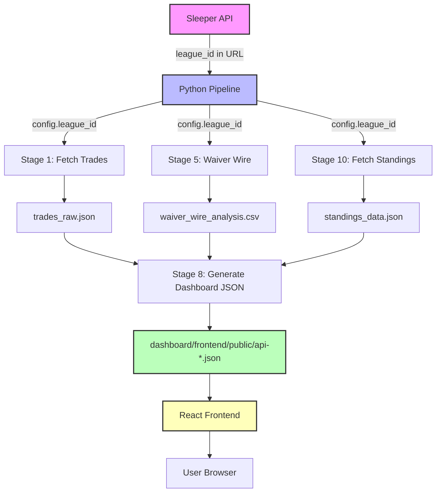

# Multi-Season League ID Architecture Design

**Project**: Fantasy Football Trade Analysis Dashboard  
**Date**: 2025-12-31  
**Status**: Design Document - Implementation Pending  
**Priority**: URGENT - Season 3 launches tomorrow

---

## Executive Summary

The dashboard was built for a single League ID (Season 2, 2024). We need immediate support for Season 3 (launching tomorrow) and historical integration of Season 1. This document provides a comprehensive architectural analysis and three implementation options with detailed recommendations.

**Critical Timeline**:
- ⚡ **Season 3 Support**: REQUIRED BY TOMORROW
- 📊 **Season 1 Integration**: Lower priority, can be phased

---

## Table of Contents

1. [Current State Analysis](#1-current-state-analysis)
2. [Architecture Options](#2-architecture-options)
3. [Recommendation & Justification](#3-recommendation--justification)
4. [Implementation Specifications](#4-implementation-specifications)
5. [Migration Strategy](#5-migration-strategy)
6. [Testing & Rollback](#6-testing--rollback)

---

## 1. Current State Analysis

### 1.1 League ID Dependencies Audit

#### **Configuration Layer**
```yaml
# pipeline/config/default.yaml (Line 11)
league:
  id: "1180814327660371968"  # ⚠️ HARDCODED - Season 2 only
  name: "Main Dynasty League"
  platform: "sleeper"
```

**Impact**: Single source of truth, loaded by [`config.py`](pipeline/config.py:117) as singleton pattern.

#### **Pipeline Stage Dependencies**
All pipeline stages consume `config.league_id`:

| Stage | Script | League ID Usage | Breaking Change |
|-------|--------|-----------------|-----------------|
| 0 | [`detect_current_week.py`](pipeline/scripts/detect_current_week.py:49) | `LEAGUE_ID = config.league_id` | ✅ API calls fail |
| 1 | [`stage1_fetch_trades.py`](pipeline/stage1_fetch_trades.py:59) | API: `/league/{league_id}/...` | ✅ Wrong trades |
| 2-4 | Processing stages | Indirect (read Stage 1 output) | ⚠️ Wrong metadata |
| 5 | [`stage5_waiver_wire.py`](pipeline/stage5_waiver_wire.py:302) | `league_id = config['league']['id']` | ✅ Wrong waivers |
| 6 | [`analyze_2026_pick_ownership.py`](pipeline/analyze_2026_pick_ownership.py:25) | `LEAGUE_ID = config.league_id` | ✅ Wrong picks |
| 7 | [`generate_playoff_bracket.py`](pipeline/generate_playoff_bracket.py:63) | `league_id = config.league_id` | ✅ Wrong bracket |
| 7a | [`calculate_progressive_draft_order.py`](pipeline/scripts/calculate_progressive_draft_order.py:38) | `LEAGUE_ID = config.league_id` | ✅ Wrong draft |
| 8+ | JSON generation | Metadata includes league_id | ⚠️ Wrong context |
| 10 | [`fetch_standings.py`](pipeline/scripts/fetch_standings.py:25) | `LEAGUE_ID = config.league_id` | ✅ Wrong standings |
| 11 | [`simulate_playoff_scenarios.py`](pipeline/scripts/simulate_playoff_scenarios.py:39) | `LEAGUE_ID = config.league_id` | ✅ Wrong scenarios |

**Total Touchpoints**: 62 explicit references across 15+ files

#### **API Client Layer**
```python
# utils/api_client.py
def fetch_bracket_data(league_id: str) -> Dict[str, Any]:
    winners_url = f"{SLEEPER_API_BASE}/league/{league_id}/winners_bracket"
    losers_url = f"{SLEEPER_API_BASE}/league/{league_id}/losers_bracket"
```

All Sleeper API calls require `league_id` in URL path.

#### **Data Storage Architecture**
```
pipeline/
├── trades_raw.json                    # ⚠️ OVERWRITTEN each run
├── league_trades_analysis_pipeline.csv # ⚠️ OVERWRITTEN each run
├── waiver_wire_analysis.csv           # ⚠️ OVERWRITTEN each run
├── standings_data.json                # ⚠️ OVERWRITTEN each run
├── playoff_scenarios_simulated.json   # ⚠️ OVERWRITTEN each run
└── team_identity_mapping.csv          # ⚠️ SHARED across seasons

dashboard/frontend/public/
├── api-trades.json        # ⚠️ SINGLE season only
├── api-teams.json         # ⚠️ SINGLE season only
├── api-standings.json     # ⚠️ SINGLE season only
└── api-playoff-scenarios.json # ⚠️ SINGLE season only
```

**Critical Issue**: NO season isolation - all files overwritten on each pipeline run.

#### **Frontend Architecture**
```typescript
// dashboard/frontend/src/services/api.ts
export const api = {
  getTrades: async () => apiFetch('/api-trades.json'),
  getTeams: async () => apiFetch('/api-teams.json'),
  getWaiverWireData: () => apiFetch('/api-waiver-wire.json'),
  // NO season parameter - assumes single season
};
```

**Frontend has ZERO awareness of multiple seasons.**

### 1.2 Data Flow Mapping



**Critical Path**: `Sleeper API → Config → Pipeline → JSON → Frontend`

**Breaking Points When League ID Changes**:
1. ✅ **Sleeper API calls** - All fail with 404/wrong data
2. ✅ **Pipeline outputs** - Overwrite previous season data
3. ✅ **Team identity mapping** - Names change across seasons
4. ✅ **Frontend** - Displays wrong season without awareness
5. ✅ **Historical data** - Completely lost on each run

### 1.3 Breaking Points Analysis

| Component | Failure Mode | Severity | User Impact |
|-----------|--------------|----------|-------------|
| **API Fetching** | Wrong/no data returned | 🔴 Critical | Dashboard shows wrong season |
| **Data Storage** | Overwritten files | 🔴 Critical | Historical data LOST |
| **Team Mapping** | Name mismatches | 🟡 High | Confusing team names |
| **Frontend** | No season awareness | 🟡 High | Users can't switch seasons |
| **Metadata** | Wrong league_id embedded | 🟢 Medium | Debugging confusion |
| **Backups** | All seasons in same dir | 🟢 Medium | Backup/restore complexity |

**Worst-Case Scenario**: Switching to Season 3 tomorrow will **permanently erase all Season 2 data** unless we implement season isolation.

---

## 2. Architecture Options

### Option A: Active Season Pattern (Config Switching)

**Concept**: Maintain single active season via configuration, manually switch when needed.

#### Architecture

```yaml
# pipeline/config/default.yaml
league:
  active_season: "season_3"  # Points to current season
  
seasons:
  season_1:
    id: "SEASON_1_LEAGUE_ID"
    name: "Dynasty League - Season 1"
    year: 2023
    status: "historical"
  season_2:
    id: "1180814327660371968"
    name: "Dynasty League - Season 2"
    year: 2024
    status: "historical"
  season_3:
    id: "SEASON_3_LEAGUE_ID"
    name: "Dynasty League - Season 3"
    year: 2025
    status: "active"
```

```python
# config.py modifications
@dataclass
class SeasonConfig:
    id: str
    name: str
    year: int
    status: str  # active, historical, future

@dataclass
class PipelineConfig:
    active_season: str
    seasons: Dict[str, SeasonConfig]
    # ... existing fields
    
    @property
    def league_id(self) -> str:
        """Get active season's league ID"""
        return self.seasons[self.active_season].id
```

#### Data Storage
```
pipeline/
├── output/
│   ├── season_1/
│   │   ├── trades_raw.json
│   │   ├── standings_data.json
│   │   └── ...
│   ├── season_2/
│   │   ├── trades_raw.json
│   │   └── ...
│   └── season_3/
│       ├── trades_raw.json
│       └── ...

dashboard/frontend/public/
├── api-trades.json         # Active season only
├── api-standings.json      # Active season only
└── ...
```

#### Frontend Changes
```typescript
// services/api.ts - NO CHANGES NEEDED
// Dashboard always shows active season
// To view historical: manually switch config, re-run pipeline
```

#### Pros
- ✅ **Minimal code changes** - ~50 lines modified
- ✅ **Fast implementation** - 2-4 hours
- ✅ **Simple mental model** - One season active at a time
- ✅ **No frontend changes** - Existing UI works as-is
- ✅ **Preserves historical data** - Season-scoped directories
- ✅ **Easy rollback** - Change config, re-run pipeline

#### Cons
- ❌ **Manual switching required** - Edit config, re-run pipeline
- ❌ **No simultaneous access** - Can't compare seasons without re-running
- ❌ **Dashboard only shows active** - Historical requires rebuild
- ❌ **User experience limitation** - No season selector in UI

#### Implementation Effort
| Task | Effort | Risk |
|------|--------|------|
| Config schema update | 1 hour | Low |
| Season-scoped storage | 1 hour | Low |
| Pipeline path updates | 2 hours | Medium |
| Testing | 2 hours | Low |
| **TOTAL** | **6 hours** | **Low** |

---

### Option B: Multi-Season Pipeline (Parallel Execution)

**Concept**: Pipeline processes ALL seasons in single run, frontend provides season selector.

#### Architecture

```python
# Modified update_dashboard.py
SEASONS_CONFIG = {
    'season_1': {
        'league_id': 'SEASON_1_LEAGUE_ID',
        'year': 2023,
        'enabled': True
    },
    'season_2': {
        'league_id': '1180814327660371968',
        'year': 2024,
        'enabled': True
    },
    'season_3': {
        'league_id': 'SEASON_3_LEAGUE_ID',
        'year': 2025,
        'enabled': True,
        'active': True  # Default view
    }
}

def run_pipeline_for_season(season_key, season_config):
    """Run full pipeline for a specific season"""
    # Set league_id in config
    # Run all stages
    # Output to season-specific directory
    pass

for season_key, config in SEASONS_CONFIG.items():
    if config['enabled']:
        run_pipeline_for_season(season_key, config)
```

#### Data Storage
```
pipeline/
├── output/
│   ├── season_1/
│   │   ├── trades_raw.json
│   │   └── ...
│   ├── season_2/
│   │   └── ...
│   └── season_3/
│       └── ...

dashboard/frontend/public/
├── seasons/
│   ├── season_1/
│   │   ├── api-trades.json
│   │   └── ...
│   ├── season_2/
│   │   └── ...
│   └── season_3/
│       └── ...
├── api-seasons.json  # Season metadata
└── api-trades.json   # Symlink/copy to active season
```

#### Frontend Changes
```typescript
// NEW: Season selector component
interface SeasonSelectorProps {
  currentSeason: string;
  onSeasonChange: (season: string) => void;
}

// api.ts modifications
export const api = {
  getSeasons: () => apiFetch('/api-seasons.json'),
  getTrades: (season?: string) => {
    const path = season 
      ? `/seasons/${season}/api-trades.json`
      : '/api-trades.json';
    return apiFetch(path);
  },
  // All endpoints get optional season parameter
};

// App-level season context
const SeasonContext = React.createContext<string>('season_3');
```

#### Pros
- ✅ **All seasons always available** - No manual switching
- ✅ **Compare across seasons** - Side-by-side analysis possible
- ✅ **Better user experience** - Dropdown to switch seasons
- ✅ **Automated updates** - All seasons refresh together
- ✅ **Historical preservation** - Always maintained

#### Cons
- ❌ **Complex implementation** - 3x API calls per pipeline run
- ❌ **Longer execution time** - 3x pipeline duration (30-45 min)
- ❌ **Higher API load** - 3x Sleeper API requests (rate limit risk)
- ❌ **Significant frontend work** - Season context, routing, selectors
- ❌ **Storage overhead** - 3x data files (~15MB → ~45MB)
- ❌ **Historical data challenges** - Season 1 may have incomplete data

#### Implementation Effort
| Task | Effort | Risk |
|------|--------|------|
| Multi-season config | 2 hours | Medium |
| Parallel pipeline execution | 4 hours | High |
| Season-scoped JSON generation | 3 hours | Medium |
| Frontend season context | 4 hours | Medium |
| Season selector UI | 3 hours | Low |
| API modifications | 4 hours | Medium |
| Cross-season comparison features | 8 hours | High |
| Testing all combinations | 6 hours | High |
| **TOTAL** | **34 hours** | **High** |

---

### Option C: Season-Scoped Data Architecture (Metadata-Driven)

**Concept**: Hybrid approach - season isolation with metadata registry, selective frontend access.

#### Architecture

```yaml
# pipeline/config/seasons.yaml
seasons:
  season_1:
    league_id: "SEASON_1_LEAGUE_ID"
    name: "Season 1 - Foundation"
    year: 2023
    status: "archived"
    data_available: true
    
  season_2:
    league_id: "1180814327660371968"
    name: "Season 2 - Expansion"
    year: 2024
    status: "current"
    data_available: true
    
  season_3:
    league_id: "SEASON_3_LEAGUE_ID"
    name: "Season 3 - Evolution"
    year: 2025
    status: "active"
    data_available: true

# Default season for dashboard
default_display_season: "season_3"

# Seasons to process in pipeline run
pipeline_execution:
  enabled_seasons: ["season_2", "season_3"]  # Process both
  backfill_mode: false  # If true, process season_1 too
```

```python
# config.py
@dataclass
class SeasonMetadata:
    league_id: str
    name: str
    year: int
    status: str  # active, current, archived
    data_available: bool

class MultiSeasonConfig:
    def __init__(self, config_path: str = 'config/seasons.yaml'):
        self.seasons = self._load_seasons(config_path)
        self.default_season = self._get_default()
        self.enabled_seasons = self._get_enabled()
    
    def get_season(self, season_key: str) -> SeasonMetadata:
        return self.seasons[season_key]
```

#### Data Storage
```
pipeline/
├── seasons/
│   ├── season_1/
│   │   ├── trades_raw.json
│   │   ├── standings_data.json
│   │   ├── playoff_scenarios.json
│   │   └── metadata.json  # Season-specific metadata
│   ├── season_2/
│   │   └── ...
│   └── season_3/
│       └── ...
├── shared/
│   └── team_identity_history.json  # Track name changes

dashboard/frontend/public/
├── api-trades.json         # Default season (season_3)
├── api-standings.json      # Default season
├── api-seasons.json        # Season registry
└── seasons/
    ├── season_1/
    │   ├── api-trades.json
    │   └── metadata.json
    ├── season_2/
    │   └── ...
    └── season_3/
        └── ... (symlinked to root for active)
```

#### Pipeline Execution Strategy
```python
# update_dashboard.py modifications
def run_multi_season_pipeline():
    config = MultiSeasonConfig()
    
    # Phase 1: Process enabled seasons
    for season_key in config.enabled_seasons:
        season = config.get_season(season_key)
        run_season_pipeline(season_key, season)
    
    # Phase 2: Generate default season JSON at root
    default = config.default_season
    copy_season_to_root(default)
    
    # Phase 3: Generate season registry
    generate_season_registry(config.seasons)
```

#### Frontend Implementation (Phase 1: Basic)
```typescript
// Phase 1: Read-only, default season
// NO CHANGES to existing frontend
// Season selector added later in Phase 2

// Phase 2: Season switching (future)
interface Season {
  key: string;
  name: string;
  year: number;
  status: 'active' | 'current' | 'archived';
}

const SeasonSelector: React.FC = () => {
  const [seasons, setSeasons] = useState<Season[]>([]);
  const [selected, setSelected] = useState<string>('season_3');
  
  // Load /api-seasons.json
  // Render dropdown
  // On change, reload data from /seasons/{key}/
};
```

#### Pros
- ✅ **Flexible deployment** - Phased implementation
- ✅ **Phase 1: Quick win** - Active season works immediately
- ✅ **Phase 2: Enhanced** - Add season switching later
- ✅ **Data preservation** - All seasons isolated
- ✅ **Selective execution** - Process only needed seasons
- ✅ **Metadata-driven** - Easy to add Season 4, 5, etc.
- ✅ **Backward compatible** - Existing dashboard works unchanged
- ✅ **Scalable** - Clean structure for future seasons

#### Cons
- ⚠️ **Medium complexity** - More than Option A, less than Option B
- ⚠️ **Requires backfill** - Season 1 data needs manual processing
- ⚠️ **Storage management** - Need to track which seasons to keep
- ⚠️ **Phase 2 effort** - Season switching is optional future work

#### Implementation Effort

**Phase 1: Season Isolation (Tomorrow's Deadline)**
| Task | Effort | Risk |
|------|--------|------|
| Create seasons.yaml config | 1 hour | Low |
| Update config.py for multi-season | 2 hours | Medium |
| Season-scoped directory structure | 1 hour | Low |
| Modify pipeline to use season context | 3 hours | Medium |
| Generate season registry | 1 hour | Low |
| Copy active season to root | 0.5 hour | Low |
| Testing Season 2 → Season 3 switch | 2 hours | Medium |
| **Phase 1 TOTAL** | **10.5 hours** | **Medium** |

**Phase 2: Frontend Season Switching (Future)**
| Task | Effort | Risk |
|------|--------|------|
| Season context provider | 2 hours | Low |
| Season selector component | 2 hours | Low |
| API updates for season routing | 2 hours | Low |
| Update all data hooks | 3 hours | Medium |
| Testing | 2 hours | Low |
| **Phase 2 TOTAL** | **11 hours** | **Low** |

---

## 3. Recommendation & Justification

### ⭐ **RECOMMENDED: Option C - Season-Scoped Data Architecture (Phase 1)**

#### Why Option C Wins

| Criteria | Option A | Option B | Option C |
|----------|----------|----------|----------|
| **Speed to deploy** | ✅ Fast (6h) | ❌ Slow (34h) | ✅ Fast (10.5h) |
| **Tomorrow deadline** | ✅ YES | ❌ NO | ✅ YES |
| **Data preservation** | ✅ YES | ✅ YES | ✅ YES |
| **Frontend changes** | ✅ None | ❌ Major | ✅ None (Phase 1) |
| **Future scalability** | ⚠️ Manual | ✅ Automated | ✅ Flexible |
| **Historical access** | ❌ Manual rebuild | ✅ Always available | ⚠️ Phase 2 feature |
| **API load** | ✅ 1x per switch | ❌ 3x per run | ⚠️ 2x per run |
| **Complexity** | ✅ Simple | ❌ Complex | ⚠️ Moderate |
| **Risk level** | ✅ Low | ❌ High | ⚠️ Medium |

#### Decision Matrix

```
Priority 1: Meet tomorrow's deadline
  ✅ Option A: 6 hours
  ❌ Option B: 34 hours (IMPOSSIBLE)
  ✅ Option C: 10.5 hours

Priority 2: Preserve Season 2 data
  ✅ Option A: YES
  ✅ Option B: YES
  ✅ Option C: YES

Priority 3: Future-proof architecture
  ⚠️ Option A: Manual switching forever
  ✅ Option B: Fully automated
  ✅ Option C: Phased evolution

Priority 4: Minimal risk
  ✅ Option A: Low risk
  ❌ Option B: High risk (too many changes)
  ⚠️ Option C: Medium risk (manageable)

WINNER: Option C (Phase 1)
```

#### Strategic Advantages

1. **Immediate Value**: Season 3 support within 10.5 hours
2. **Data Safety**: Season 2 data preserved in isolated directory
3. **No Breaking Changes**: Existing dashboard continues working
4. **Future Optionality**: Phase 2 adds season switching when ready
5. **Clean Architecture**: Metadata-driven, easy to add Season 4+
6. **Reduced Risk**: Phased deployment limits blast radius

#### Why NOT Option A

While Option A is fastest (6 hours), it has critical limitations:
- ❌ **Manual switching forever** - Always requires config edit + pipeline re-run
- ❌ **Poor UX** - Users can't access historical data without engineer intervention
- ❌ **Not scalable** - Season 4, 5, 6... same manual process

Option A is **tactical**, not strategic.

#### Why NOT Option B

Option B is the "ideal" solution but:
- ❌ **34 hours** - Impossible to meet tomorrow's deadline
- ❌ **High complexity** - Major refactor of pipeline AND frontend
- ❌ **High risk** - Too many simultaneous changes
- ❌ **API load** - 3x Sleeper API calls could hit rate limits
- ❌ **Historical data** - Season 1 may be incomplete/corrupted

Option B is **over-engineered** for current needs.

---

## 4. Implementation Specifications

### Phase 1: Season Isolation (URGENT - Tomorrow's Deadline)

#### 4.1 Configuration Schema

**NEW FILE**: `pipeline/config/seasons.yaml`

```yaml
# Season Registry
# Each season represents a distinct Sleeper league
seasons:
  season_1:
    league_id: "SEASON_1_LEAGUE_ID_PLACEHOLDER"
    name: "Dynasty League - Season 1 (2023)"
    year: 2023
    status: "archived"
    enabled: false  # Don't process until backfill requested
    
  season_2:
    league_id: "1180814327660371968"
    name: "Dynasty League - Season 2 (2024)"
    year: 2024
    status: "current"
    enabled: true  # Process to preserve data
    
  season_3:
    league_id: "SEASON_3_LEAGUE_ID_HERE"  # ⚠️ UPDATE TOMORROW
    name: "Dynasty League - Season 3 (2025)"
    year: 2025
    status: "active"
    enabled: true  # Primary season

# Default season displayed in dashboard
default_display_season: "season_3"

# Pipeline execution settings
pipeline:
  # Which seasons to process on each run
  enabled_seasons:
    - "season_2"  # Keep historical data fresh
    - "season_3"  # Active season
  
  # Backfill mode: Process all enabled seasons regardless of status
  backfill_mode: false
  
  # Parallel execution (future optimization)
  parallel: false
  max_workers: 2

# Storage configuration
storage:
  # Base directory for all season data
  seasons_dir: "./seasons"
  
  # Shared resources across seasons
  shared_dir: "./shared"
  
  # Backup retention per season
  retention_days: 90
```

**MODIFY**: `pipeline/config/default.yaml`

```yaml
# Remove league section (moved to seasons.yaml)
# Keep all other sections unchanged
pipeline:
  name: "trade_analysis"
  version: "2.0.0"  # Bump for multi-season support
  description: "Dynasty fantasy football trade analysis pipeline - Multi-Season"

# Add reference to seasons config
seasons_config: "config/seasons.yaml"

# ... rest of file unchanged (api, valuations, storage, etc.)
```

#### 4.2 Configuration Loader Updates

**MODIFY**: `pipeline/config.py`

```python
"""
Pipeline Configuration Loader - Multi-Season Support
"""

from dataclasses import dataclass
from typing import Dict, Optional, List
from pathlib import Path
import yaml
import logging

logger = logging.getLogger(__name__)


@dataclass
class SeasonConfig:
    """Configuration for a single season"""
    league_id: str
    name: str
    year: int
    status: str  # active, current, archived
    enabled: bool


@dataclass
class MultiSeasonConfig:
    """Multi-season configuration"""
    seasons: Dict[str, SeasonConfig]
    default_display_season: str
    enabled_seasons: List[str]
    backfill_mode: bool
    parallel: bool
    max_workers: int
    seasons_dir: Path
    shared_dir: Path
    retention_days: int
    
    def get_season(self, season_key: str) -> SeasonConfig:
        """Get configuration for specific season"""
        if season_key not in self.seasons:
            raise ValueError(f"Unknown season: {season_key}")
        return self.seasons[season_key]
    
    def get_active_season(self) -> SeasonConfig:
        """Get the currently active season"""
        return self.get_season(self.default_display_season)
    
    def get_enabled_seasons(self) -> List[SeasonConfig]:
        """Get all seasons that should be processed"""
        return [self.seasons[key] for key in self.enabled_seasons]


@dataclass
class PipelineConfig:
    """Complete pipeline configuration (legacy + multi-season)"""
    
    # Multi-season support
    multi_season: MultiSeasonConfig
    
    # Legacy fields for backward compatibility
    league_id: str  # Points to active season's league_id
    league_name: str  # Points to active season's name
    
    # Unchanged fields
    sleeper_api: APIConfig
    github_api: GitHubConfig
    valuations: ValuationConfig
    storage: StorageConfig
    validation: ValidationConfig
    log_level: str
    parallel_workers: int
    
    @classmethod
    def load(cls, 
             config_file: str = 'config/default.yaml',
             seasons_file: str = 'config/seasons.yaml') -> 'PipelineConfig':
        """
        Load configuration from YAML files.
        
        Args:
            config_file: Path to main config (default.yaml)
            seasons_file: Path to seasons config (seasons.yaml)
            
        Returns:
            PipelineConfig instance with multi-season support
        """
        config_path = Path(config_file)
        seasons_path = Path(seasons_file)
        
        if not config_path.exists():
            raise FileNotFoundError(f"Config file not found: {config_file}")
        
        if not seasons_path.exists():
            raise FileNotFoundError(f"Seasons config not found: {seasons_file}")
        
        # Load main config
        with open(config_path, 'r') as f:
            data = yaml.safe_load(f)
        
        # Load seasons config
        with open(seasons_path, 'r') as f:
            seasons_data = yaml.safe_load(f)
        
        # Parse seasons
        seasons = {}
        for key, season_data in seasons_data['seasons'].items():
            seasons[key] = SeasonConfig(**season_data)
        
        # Parse pipeline execution settings
        pipeline_settings = seasons_data.get('pipeline', {})
        storage_settings = seasons_data.get('storage', {})
        
        multi_season = MultiSeasonConfig(
            seasons=seasons,
            default_display_season=seasons_data['default_display_season'],
            enabled_seasons=pipeline_settings.get('enabled_seasons', []),
            backfill_mode=pipeline_settings.get('backfill_mode', False),
            parallel=pipeline_settings.get('parallel', False),
            max_workers=pipeline_settings.get('max_workers', 2),
            seasons_dir=Path(storage_settings.get('seasons_dir', './seasons')),
            shared_dir=Path(storage_settings.get('shared_dir', './shared')),
            retention_days=storage_settings.get('retention_days', 90)
        )
        
        # Get active season for legacy compatibility
        active_season = multi_season.get_active_season()
        
        # Parse existing config sections
        api = data['api']
        vals = data['valuations']
        storage = data['storage']
        validation = data['validation']
        logging_cfg = data['logging']
        perf = data['performance']
        
        return cls(
            multi_season=multi_season,
            league_id=active_season.league_id,  # Legacy compatibility
            league_name=active_season.name,     # Legacy compatibility
            sleeper_api=APIConfig(**api['sleeper']),
            github_api=GitHubConfig(**api['github']),
            valuations=ValuationConfig(
                tiers=TierValues(**vals['tiers']),
                faab_multiplier=vals['faab_multiplier'],
                draft_completion_date=vals['draft_completion_date'],
                season_start_date=vals['season_start_date']
            ),
            storage=StorageConfig(
                output_dir=Path(storage['output_dir']),
                backup_dir=Path(storage['backup_dir']),
                logs_dir=Path(storage['logs_dir']),
                metrics_dir=Path(storage['metrics_dir']),
                retention_days=storage['retention_days']
            ),
            validation=ValidationConfig(**validation),
            log_level=logging_cfg['level'],
            parallel_workers=perf['parallel_workers']
        )
    
    def get_season_output_dir(self, season_key: str) -> Path:
        """Get output directory for specific season"""
        return self.multi_season.seasons_dir / season_key
    
    def validate(self):
        """Validate configuration values"""
        # Validate multi-season config
        if not self.multi_season.default_display_season:
            raise ValueError("default_display_season cannot be empty")
        
        if self.multi_season.default_display_season not in self.multi_season.seasons:
            raise ValueError(f"default_display_season '{self.multi_season.default_display_season}' not in seasons list")
        
        # Validate at least one season is enabled
        if not self.multi_season.enabled_seasons:
            raise ValueError("At least one season must be enabled in pipeline.enabled_seasons")
        
        # Validate all enabled seasons exist
        for season_key in self.multi_season.enabled_seasons:
            if season_key not in self.multi_season.seasons:
                raise ValueError(f"Enabled season '{season_key}' not found in seasons list")
        
        # Validate active season
        if not self.league_id:
            raise ValueError("Active season league_id cannot be empty")
        
        # Validate API config (unchanged)
        if self.sleeper_api.timeout <= 0:
            raise ValueError("API timeout must be positive")
        
        if not (0 < self.validation.max_zero_value_pct <= 1):
            raise ValueError("max_zero_value_pct must be between 0 and 1")
        
        logger.info("✓ Multi-season configuration validated")
        logger.info(f"  Active season: {self.multi_season.default_display_season}")
        logger.info(f"  Enabled seasons: {', '.join(self.multi_season.enabled_seasons)}")


# Global config instance (singleton)
_config: Optional[PipelineConfig] = None


def get_config() -> PipelineConfig:
    """
    Get global configuration instance (singleton pattern).
    
    Returns:
        PipelineConfig instance with multi-season support
    """
    global _config
    if _config is None:
        _config = PipelineConfig.load()
        _config.validate()
    return _config


def get_season_config(season_key: str) -> SeasonConfig:
    """
    Get configuration for specific season.
    
    Args:
        season_key: Season identifier (e.g., 'season_3')
        
    Returns:
        SeasonConfig for the specified season
    """
    config = get_config()
    return config.multi_season.get_season(season_key)


# Backward compatibility helper
def get_league_id() -> str:
    """Get active season's league ID (backward compatibility)"""
    return get_config().league_id
```

#### 4.3 Directory Structure

**NEW STRUCTURE**:

```
pipeline/
├── config/
│   ├── default.yaml           # Main config (modified)
│   ├── seasons.yaml           # ⭐ NEW: Season registry
│   └── current_week.json      # Unchanged
│
├── seasons/                   # ⭐ NEW: Season-scoped data
│   ├── season_1/
│   │   ├── trades_raw.json
│   │   ├── league_trades_analysis_pipeline.csv
│   │   ├── waiver_wire_analysis.csv
│   │   ├── standings_data.json
│   │   ├── playoff_scenarios_simulated.json
│   │   ├── 3team_trades_analysis.json
│   │   ├── asset_values_cache.csv
│   │   ├── team_identity_mapping.csv
│   │   └── metadata.json      # Season metadata
│   ├── season_2/
│   │   └── ... (same structure)
│   └── season_3/
│       └── ... (same structure)
│
├── shared/                    # ⭐ NEW: Cross-season resources
│   ├── team_identity_history.json  # Name changes across seasons
│   └── player_value_history.json  # Historical player values
│
├── backups/                   # Modified: Season-aware backups
│   ├── season_1/
│   │   └── YYYY-MM-DD_HH-MM-SS/
│   ├── season_2/
│   │   └── ...
│   └── season_3/
│       └── ...
│
└── ... (stage scripts unchanged)

dashboard/frontend/public/
├── api-trades.json            # Symlink/copy to active season
├── api-teams.json             # Symlink/copy to active season
├── api-standings.json         # Symlink/copy to active season
├── api-playoff-scenarios.json # Symlink/copy to active season
├── api-waiver-wire.json       # Symlink/copy to active season
├── api-draft-order.json       # Symlink/copy to active season
├── api-stats-summary.json     # Symlink/copy to active season
│
├── api-seasons.json           # ⭐ NEW: Season registry for frontend
│
└── seasons/                   # ⭐ NEW: Season-specific JSON
    ├── season_1/
    │   ├── api-trades.json
    │   ├── api-teams.json
    │   └── metadata.json
    ├── season_2/
    │   └── ...
    └── season_3/
        └── ...
```

#### 4.4 Pipeline Execution Flow

**MODIFY**: `update_dashboard.py`

```python
#!/usr/bin/env python3
"""
Trade Analysis Dashboard Update Script - Multi-Season Support
"""

import subprocess
import os
import sys
import json
from pathlib import Path
from datetime import datetime

# Import multi-season config
sys.path.insert(0, 'pipeline')
from config import get_config, get_season_config


def run_pipeline_for_season(season_key: str, dry_run: bool = False):
    """
    Run complete pipeline for a specific season.
    
    Args:
        season_key: Season identifier (e.g., 'season_3')
        dry_run: If True, show what would be done without executing
    """
    config = get_config()
    season = config.multi_season.get_season(season_key)
    
    print(f"\n{'='*80}")
    print(f"📊 PROCESSING {season.name.upper()}")
    print(f"{'='*80}")
    print(f"  League ID: {season.league_id}")
    print(f"  Status: {season.status}")
    print(f"  Year: {season.year}")
    
    if dry_run:
        print("  [DRY RUN MODE]")
        return True
    
    # Create season output directory
    season_dir = config.get_season_output_dir(season_key)
    season_dir.mkdir(parents=True, exist_ok=True)
    
    # Set environment variable for season context
    env = os.environ.copy()
    env['ACTIVE_SEASON'] = season_key
    env['SEASON_LEAGUE_ID'] = season.league_id
    env['SEASON_OUTPUT_DIR'] = str(season_dir)
    
    # Pipeline stages (same as before, but with season context)
    stages = [
        ("Stage 0: Detect Current Week", "python3 scripts/detect_current_week.py"),
        ("Stage 1: Fetch Trades", "python3 stage1_fetch_trades.py"),
        ("Stage 2: Extract Assets", "python3 stage2_extract_assets.py"),
        ("Stage 3: Cache Values", "python3 stage3_cache_values.py"),
        ("Stage 4: Generate Analysis", "python3 stage4_final.py"),
        ("Stage 5: Waiver Wire", "python3 stage5_waiver_wire.py"),
        ("Stage 6: 2026 Pick Ownership", "python3 analyze_2026_pick_ownership.py"),
        ("Stage 7: Playoff Bracket", "python3 generate_playoff_bracket.py"),
        ("Stage 7a: Draft Order", "python3 scripts/calculate_progressive_draft_order.py"),
        ("Stage 10: Fetch Standings", "python3 scripts/fetch_standings.py"),
        ("Stage 11: Playoff Simulations", "python3 scripts/simulate_playoff_scenarios.py"),
    ]
    
    for stage_name, command in stages:
        print(f"\n🔄 {stage_name}")
        try:
            result = subprocess.run(
                command,
                shell=True,
                check=True,
                cwd='pipeline',
                env=env,
                capture_output=True,
                text=True
            )
            print(f"   ✅ Completed")
        except subprocess.CalledProcessError as e:
            print(f"   ❌ Failed: {e}")
            return False
    
    return True


def generate_season_dashboard_json(season_key: str):
    """Generate dashboard JSON files for a specific season"""
    config = get_config()
    season_dir = config.get_season_output_dir(season_key)
    dashboard_season_dir = Path('dashboard/frontend/public/seasons') / season_key
    dashboard_season_dir.mkdir(parents=True, exist_ok=True)
    
    print(f"\n📁 Generating dashboard JSON for {season_key}...")
    
    # Run JSON generation script with season context
    env = os.environ.copy()
    env['ACTIVE_SEASON'] = season_key
    env['SEASON_OUTPUT_DIR'] = str(season_dir)
    env['DASHBOARD_OUTPUT_DIR'] = str(dashboard_season_dir)
    
    subprocess.run(
        "python3 scripts/generate_dashboard_json.py",
        shell=True,
        check=True,
        cwd='pipeline',
        env=env
    )
    
    subprocess.run(
        "python3 scripts/generate_waiver_wire_dashboard_json.py",
        shell=True,
        check=True,
        cwd='pipeline',
        env=env
    )
    
    print(f"   ✅ Dashboard JSON generated for {season_key}")


def copy_active_season_to_root():
    """Copy active season's JSON files to dashboard root"""
    config = get_config()
    active_key = config.multi_season.default_display_season
    
    print(f"\n📋 Copying {active_key} to dashboard root...")
    
    dashboard_root = Path('dashboard/frontend/public')
    season_dir = dashboard_root / 'seasons' / active_key
    
    json_files = [
        'api-trades.json',
        'api-teams.json',
        'api-standings.json',
        'api-playoff-scenarios.json',
        'api-waiver-wire.json',
        'api-draft-order.json',
        'api-stats-summary.json'
    ]
    
    for filename in json_files:
        src = season_dir / filename
        dst = dashboard_root / filename
        
        if src.exists():
            import shutil
            shutil.copy2(src, dst)
            print(f"   ✅ {filename}")
        else:
            print(f"   ⚠️  {filename} not found in season directory")


def generate_season_registry():
    """Generate api-seasons.json registry"""
    config = get_config()
    
    print("\n📚 Generating season registry...")
    
    seasons_data = {
        'seasons': [],
        'default_season': config.multi_season.default_display_season,
        'last_updated': datetime.now().isoformat()
    }
    
    for key, season in config.multi_season.seasons.items():
        seasons_data['seasons'].append({
            'key': key,
            'name': season.name,
            'year': season.year,
            'status': season.status,
            'data_available': season.enabled
        })
    
    registry_path = Path('dashboard/frontend/public/api-seasons.json')
    with open(registry_path, 'w') as f:
        json.dump(seasons_data, f, indent=2)
    
    print(f"   ✅ Season registry generated")


def main():
    import argparse
    parser = argparse.ArgumentParser(description="Multi-Season Dashboard Update")
    parser.add_argument("--dry-run", action="store_true")
    parser.add_argument("--skip-git", action="store_true")
    parser.add_argument("--season", help="Process specific season only")
    args = parser.parse_args()
    
    print("🏈 MULTI-SEASON DASHBOARD UPDATE")
    print("="*80)
    
    config = get_config()
    
    # Determine which seasons to process
    if args.season:
        seasons_to_process = [args.season]
    else:
        seasons_to_process = config.multi_season.enabled_seasons
    
    print(f"\nSeasons to process: {', '.join(seasons_to_process)}")
    
    # Process each season
    for season_key in seasons_to_process:
        if not run_pipeline_for_season(season_key, args.dry_run):
            print(f"\n❌ Pipeline failed for {season_key}")
            sys.exit(1)
        
        if not args.dry_run:
            generate_season_dashboard_json(season_key)
    
    # Generate dashboard files
    if not args.dry_run:
        copy_active_season_to_root()
        generate_season_registry()
    
    # Git deployment (unchanged)
    if not args.skip_git and not args.dry_run:
        timestamp = datetime.now().strftime("%Y-%m-%d %H:%M:%S")
        commit_msg = f"data: update dashboard data (multi-season) - {timestamp}"
        
        subprocess.run("git add .", shell=True, check=True)
        subprocess.run(f'git commit -m "{commit_msg}"', shell=True, check=True)
        subprocess.run("git push origin main", shell=True, check=True)
        
        print("\n🎉 Deployment triggered!")
    
    print(f"\n{'='*80}")
    print("✅ MULTI-SEASON UPDATE COMPLETE")
    print(f"{'='*80}")


if __name__ == "__main__":
    try:
        main()
    except Exception as e:
        print(f"\n❌ Error: {e}")
        sys.exit(1)
```

#### 4.5 Season Registry JSON

**NEW FILE**: `dashboard/frontend/public/api-seasons.json`

```json
{
  "seasons": [
    {
      "key": "season_1",
      "name": "Dynasty League - Season 1 (2023)",
      "year": 2023,
      "status": "archived",
      "data_available": false
    },
    {
      "key": "season_2",
      "name": "Dynasty League - Season 2 (2024)",
      "year": 2024,
      "status": "current",
      "data_available": true
    },
    {
      "key": "season_3",
      "name": "Dynasty League - Season 3 (2025)",
      "year": 2025,
      "status": "active",
      "data_available": true
    }
  ],
  "default_season": "season_3",
  "last_updated": "2025-12-31T18:00:00Z"
}
```

---

## 5. Migration Strategy

### 5.1 Immediate Action Plan (Season 3 Launch Tomorrow)

#### Timeline: 10.5 Hours Total

| Phase | Task | Duration | Risk | Owner |
|-------|------|----------|------|-------|
| **Prep** | Get Season 3 League ID from Sleeper | 5 min | Low | User |
| **Prep** | Backup current Season 2 data | 10 min | Low | Dev |
| **Phase 1** | Create `seasons.yaml` config | 1 hour | Low | Dev |
| **Phase 1** | Update `config.py` for multi-season | 2 hours | Medium | Dev |
| **Phase 1** | Create season directory structure | 30 min | Low | Dev |
| **Phase 1** | Modify pipeline stages for season context | 3 hours | Medium | Dev |
| **Phase 1** | Update `update_dashboard.py` | 2 hours | Medium | Dev |
| **Phase 1** | Generate season registry | 30 min | Low | Dev |
| **Testing** | Test Season 2 data preserved | 30 min | Medium | Dev |
| **Testing** | Test Season 3 pipeline run | 1 hour | High | Dev |
| **Deploy** | Deploy to production | 30 min | Medium | Dev |

#### Step-by-Step Execution

**BEFORE YOU START** (5 minutes):
```bash
# 1. Get Season 3 League ID
# Go to Sleeper app → Your League → Settings → League ID
# Copy the ID (long number string)

# 2. Backup ALL current data
cd /path/to/trade-analysis-dashboard
python3 -c "
import shutil
from datetime import datetime
backup_name = f'SEASON_2_BACKUP_{datetime.now().strftime(\"%Y%m%d_%H%M%S\")}'
shutil.copytree('pipeline', f'backups/{backup_name}/pipeline', ignore=shutil.ignore_patterns('__pycache__'))
shutil.copytree('dashboard/frontend/public', f'backups/{backup_name}/dashboard_public')
print(f'Backup created: backups/{backup_name}')
"
```

**STEP 1: Create Configuration** (1 hour)

```bash
# Create seasons.yaml
cat > pipeline/config/seasons.yaml << 'EOF'
seasons:
  season_1:
    league_id: "SEASON_1_LEAGUE_ID_PLACEHOLDER"
    name: "Dynasty League - Season 1 (2023)"
    year: 2023
    status: "archived"
    enabled: false
    
  season_2:
    league_id: "1180814327660371968"
    name: "Dynasty League - Season 2 (2024)"
    year: 2024
    status: "current"
    enabled: true
    
  season_3:
    league_id: "YOUR_SEASON_3_ID_HERE"  # ⚠️ REPLACE WITH ACTUAL ID
    name: "Dynasty League - Season 3 (2025)"
    year: 2025
    status: "active"
    enabled: true

default_display_season: "season_3"

pipeline:
  enabled_seasons:
    - "season_2"
    - "season_3"
  backfill_mode: false
  parallel: false
  max_workers: 2

storage:
  seasons_dir: "./seasons"
  shared_dir: "./shared"
  retention_days: 90
EOF

# Verify seasons.yaml
cat pipeline/config/seasons.yaml
```

**STEP 2: Update Config Loader** (2 hours)

See section 4.2 above - copy the entire updated [`config.py`](pipeline/config.py) code.

**STEP 3: Create Directory Structure** (30 minutes)

```bash
cd pipeline

# Create season directories
mkdir -p seasons/season_1
mkdir -p seasons/season_2
mkdir -p seasons/season_3
mkdir -p shared

# Move existing Season 2 data to season_2 directory
for file in trades_raw.json league_trades_analysis_pipeline.csv waiver_wire_analysis.csv standings_data.json playoff_scenarios_simulated.json; do
  if [ -f "$file" ]; then
    cp "$file" "seasons/season_2/"
    echo "Preserved: $file → seasons/season_2/"
  fi
done

# Create dashboard season directories
cd ../dashboard/frontend/public
mkdir -p seasons/season_1
mkdir -p seasons/season_2
mkdir -p seasons/season_3

# Copy existing dashboard JSON to season_2
for file in api-*.json; do
  if [ -f "$file" ]; then
    cp "$file" "seasons/season_2/"
    echo "Preserved: $file → seasons/season_2/"
  fi
done
```

**STEP 4: Update Pipeline Scripts** (3 hours)

Modify each script that uses `config.league_id` to be season-aware:

```python
# Example: stage1_fetch_trades.py
from config import get_config

config = get_config()

# Get season context from environment or config
season_key = os.environ.get('ACTIVE_SEASON', config.multi_season.default_display_season)
season = config.multi_season.get_season(season_key)
league_id = season.league_id

# Use league_id for API calls (rest of code unchanged)
```

**STEP 5: Update Master Script** (2 hours)

See section 4.4 above - copy the entire updated [`update_dashboard.py`](update_dashboard.py) code.

**STEP 6: Generate Season Registry** (30 minutes)

```python
# Add function to update_dashboard.py (see section 4.4)
# Generates api-seasons.json for frontend
```

**STEP 7: Test Season 2 Preservation** (30 minutes)

```bash
# Verify Season 2 data is intact
ls -lh pipeline/seasons/season_2/
ls -lh dashboard/frontend/public/seasons/season_2/

# Should see all files copied
```

**STEP 8: Test Season 3 Pipeline** (1 hour)

```bash
# Run pipeline for Season 3 only
python3 update_dashboard.py --season season_3 --skip-git

# Verify output
ls -lh pipeline/seasons/season_3/
ls -lh dashboard/frontend/public/seasons/season_3/

# Check dashboard root has Season 3 data
ls -lh dashboard/frontend/public/api-*.json
```

**STEP 9: Deploy** (30 minutes)

```bash
# Full production run
python3 update_dashboard.py

# Verify git commit
git log -1

# Verify Vercel deployment
# Check: https://dynasuiiiianalytics.vercel.app/
```

### 5.2 Rollback Strategy

**If Something Goes Wrong**:

```bash
# IMMEDIATE ROLLBACK (< 5 minutes)

# 1. Restore backup
BACKUP_DIR="backups/SEASON_2_BACKUP_YYYYMMDD_HHMMSS"  # Use your actual backup

rm -rf pipeline/config/seasons.yaml
cp -r "$BACKUP_DIR/pipeline/config" pipeline/
cp -r "$BACKUP_DIR/dashboard_public/"* dashboard/frontend/public/

# 2. Restore config.py
git checkout HEAD~1 -- pipeline/config.py

# 3. Re-run Season 2 pipeline
cd pipeline
python3 stage1_fetch_trades.py
python3 stage2_extract_assets.py
python3 stage3_cache_values.py
python3 stage4_final.py
python3 scripts/generate_dashboard_json.py

# 4. Redeploy
cd ..
git add .
git commit -m "Rollback to Season 2"
git push origin main

# Dashboard will be back to Season 2 in 2-3 minutes
```

### 5.3 Validation Checklist

**Before Declaring Success**:

- [ ] `seasons.yaml` exists and has correct Season 3 League ID
- [ ] `config.py` loads multi-season config without errors
- [ ] `pipeline/seasons/season_2/` contains all Season 2 files
- [ ] `pipeline/seasons/season_3/` contains new Season 3 files
- [ ] `dashboard/frontend/public/seasons/season_2/` has Season 2 JSON
- [ ] `dashboard/frontend/public/seasons/season_3/` has Season 3 JSON
- [ ] `dashboard/frontend/public/api-*.json` points to Season 3 (active)
- [ ] `dashboard/frontend/public/api-seasons.json` exists and valid
- [ ] Dashboard loads without errors
- [ ] Dashboard shows Season 3 data (verify team names, standings)
- [ ] Season 2 data can be manually accessed at `/seasons/season_2/api-trades.json`

---

## 6. Testing & Rollback

### 6.1 Testing Strategy

#### Unit Tests

```python
# pipeline/tests/test_multi_season_config.py

import pytest
from config import PipelineConfig, MultiSeasonConfig

def test_load_multi_season_config():
    """Test multi-season config loads correctly"""
    config = PipelineConfig.load()
    assert config.multi_season is not None
    assert len(config.multi_season.seasons) >= 3

def test_get_active_season():
    """Test active season retrieval"""
    config = PipelineConfig.load()
    active = config.multi_season.get_active_season()
    assert active.status == "active"
    assert active.enabled is True

def test_get_enabled_seasons():
    """Test enabled seasons list"""
    config = PipelineConfig.load()
    enabled = config.multi_season.get_enabled_seasons()
    assert len(enabled) >= 1
    assert all(s.enabled for s in enabled)

def test_season_output_dir():
    """Test season output directory generation"""
    config = PipelineConfig.load()
    season_dir = config.get_season_output_dir('season_3')
    assert season_dir.name == 'season_3'
    assert 'seasons' in str(season_dir)
```

#### Integration Tests

```bash
# Test Season 2 data preservation
pytest pipeline/tests/test_multi_season_config.py -v

# Test Season 3 pipeline run
python3 update_dashboard.py --season season_3 --skip-git --dry-run

# Test both seasons
python3 update_dashboard.py --skip-git --dry-run

# Verify JSON structure
cd dashboard/frontend/public
for file in api-*.json; do
  echo "=== $file ==="
  jq . "$file" > /dev/null && echo "✓ Valid JSON" || echo "✗ Invalid JSON"
done
```

#### Manual QA Checklist

**Dashboard Verification**:
- [ ] Dashboard loads at https://dynasuiiiianalytics.vercel.app/
- [ ] Overview page shows Season 3 trades
- [ ] Standings page shows Season 3 standings
- [ ] Playoff scenarios show Season 3 probabilities
- [ ] Team names match Season 3 Sleeper rosters
- [ ] Trade dates are from Season 3 timeframe
- [ ] No console errors in browser DevTools
- [ ] All pages load without errors

**Data Verification**:
- [ ] `pipeline/seasons/season_2/trades_raw.json` has Season 2 data
- [ ] `pipeline/seasons/season_3/trades_raw.json` has Season 3 data
- [ ] Season 2 and Season 3 have different `league_id` in metadata
- [ ] Dashboard root JSON files match Season 3 season directory
- [ ] `api-seasons.json` lists all 3 seasons correctly

**API Verification**:
```bash
# Verify season registry
curl https://dynasuiiiianalytics.vercel.app/api-seasons.json | jq .

# Verify active season (should be Season 3)
curl https://dynasuiiiianalytics.vercel.app/api-trades.json | jq '.data.metadata'

# Verify Season 2 is accessible
curl https://dynasuiiiianalytics.vercel.app/seasons/season_2/api-trades.json | jq '.data.metadata'
```

### 6.2 Rollback Procedures

#### Scenario 1: Config Errors

**Problem**: `seasons.yaml` misconfigured, pipeline won't start.

**Solution**:
```bash
# Fix seasons.yaml
vim pipeline/config/seasons.yaml
# Correct the error

# Validate
python3 -c "from pipeline.config import get_config; get_config()"

# Re-run
python3 update_dashboard.py
```

#### Scenario 2: Season 3 Pipeline Fails

**Problem**: Season 3 pipeline fails, but Season 2 is fine.

**Solution**:
```bash
# Disable Season 3 temporarily
# Edit pipeline/config/seasons.yaml
seasons:
  season_3:
    enabled: false  # Disable

# Change default to Season 2
default_display_season: "season_2"

# Re-run with Season 2
python3 update_dashboard.py

# Dashboard will show Season 2 until Season 3 is fixed
```

#### Scenario 3: Complete Rollback to Single-Season

**Problem**: Multi-season architecture causing issues, need to revert.

**Solution**:
```bash
# 1. Restore Season 2 backup
BACKUP_DIR="backups/SEASON_2_BACKUP_YYYYMMDD_HHMMSS"
cp -r "$BACKUP_DIR/pipeline" .
cp -r "$BACKUP_DIR/dashboard_public" dashboard/frontend/public

# 2. Revert config.py
git checkout origin/main -- pipeline/config.py

# 3. Remove seasons.yaml
rm pipeline/config/seasons.yaml

# 4. Restore default.yaml
git checkout origin/main -- pipeline/config/default.yaml

# 5. Clean up season directories
rm -rf pipeline/seasons
rm -rf dashboard/frontend/public/seasons

# 6. Re-run pipeline with Season 2
python3 update_dashboard.py

# 7. Verify dashboard works
open https://dynasuiiiianalytics.vercel.app/
```

---

### 5.4 Season 1 Historical Data Integration (Phase 2 - Future)

**When**: After Season 3 is stable (1-2 weeks post-launch)

#### Prerequisites
1. Season 1 League ID from Sleeper
2. Verification that Season 1 data is still accessible via Sleeper API
3. Historical trade/roster/standings data available

#### Steps

**STEP 1: Enable Season 1 in Config** (5 minutes)

```yaml
# pipeline/config/seasons.yaml
seasons:
  season_1:
    league_id: "ACTUAL_SEASON_1_LEAGUE_ID"  # ⚠️ UPDATE
    enabled: true  # Enable processing
```

**STEP 2: Backfill Season 1 Data** (30 minutes)

```bash
# Run pipeline for Season 1 only
python3 update_dashboard.py --season season_1 --skip-git

# Verify data quality
ls -lh pipeline/seasons/season_1/
cat pipeline/seasons/season_1/trades_raw.json | jq '.metadata'
```

**STEP 3: Validate Historical Data** (30 minutes)

```python
# Create validation script
cat > pipeline/scripts/validate_season_1.py << 'EOF'
import json
from pathlib import Path

season_1_dir = Path('seasons/season_1')

# Check all required files exist
required_files = [
    'trades_raw.json',
    'league_trades_analysis_pipeline.csv',
    'standings_data.json'
]

for file in required_files:
    path = season_1_dir / file
    if not path.exists():
        print(f"❌ Missing: {file}")
    else:
        size = path.stat().st_size
        print(f"✅ {file} ({size:,} bytes)")

# Validate trade data quality
with open(season_1_dir / 'trades_raw.json') as f:
    data = json.load(f)
    trades = data.get('trades', [])
    print(f"\n📊 Season 1 Data Quality:")
    print(f"  Total trades: {len(trades)}")
    print(f"  Date range: {data['metadata'].get('fetch_timestamp', 'N/A')}")
    print(f"  League ID: {data['metadata'].get('league_id', 'N/A')}")

print("\n✅ Season 1 validation complete")
EOF

python3 pipeline/scripts/validate_season_1.py
```

**STEP 4: Deploy Season 1** (10 minutes)

```bash
# Enable Season 1 in pipeline
# Edit pipeline/config/seasons.yaml
pipeline:
  enabled_seasons:
    - "season_1"
    - "season_2"
    - "season_3"

# Run full pipeline (all seasons)
python3 update_dashboard.py

# Season 1 will be available at /seasons/season_1/
```

#### Potential Issues with Season 1

**Issue 1: Incomplete Historical Data**
- **Cause**: Sleeper may not have full Season 1 transaction history
- **Mitigation**: Accept partial data, document gaps in metadata
- **Alternative**: Manual data entry if critical trades missing

**Issue 2: Team Name Changes**
- **Cause**: Managers may have changed team names between seasons
- **Mitigation**: Use `team_identity_history.json` to track changes
- **Solution**: Create name resolution logic in [`team_resolver.py`](pipeline/utils/team_resolver.py)

**Issue 3: Player Value Historical Data**
- **Cause**: KeepTradeCut values from 2023 not available
- **Mitigation**: Use current values (less accurate but functional)
- **Alternative**: Find historical value snapshot if available

---

## 7. Detailed File Modifications

### 7.1 Files Requiring Changes (Phase 1)

| File | Type | Lines Changed | Complexity |
|------|------|---------------|------------|
| [`pipeline/config/seasons.yaml`](pipeline/config/seasons.yaml) | NEW | ~40 | Low |
| [`pipeline/config/default.yaml`](pipeline/config/default.yaml:11) | MODIFY | ~5 | Low |
| [`pipeline/config.py`](pipeline/config.py) | MAJOR | ~150 | High |
| [`update_dashboard.py`](update_dashboard.py) | MAJOR | ~100 | High |
| [`pipeline/stage1_fetch_trades.py`](pipeline/stage1_fetch_trades.py:59) | MODIFY | ~10 | Medium |
| [`pipeline/stage5_waiver_wire.py`](pipeline/stage5_waiver_wire.py:302) | MODIFY | ~5 | Low |
| [`pipeline/scripts/fetch_standings.py`](pipeline/scripts/fetch_standings.py:25) | MODIFY | ~10 | Medium |
| [`pipeline/scripts/detect_current_week.py`](pipeline/scripts/detect_current_week.py:49) | MODIFY | ~10 | Medium |
| [`pipeline/scripts/simulate_playoff_scenarios.py`](pipeline/scripts/simulate_playoff_scenarios.py:39) | MODIFY | ~10 | Medium |
| [`pipeline/scripts/calculate_progressive_draft_order.py`](pipeline/scripts/calculate_progressive_draft_order.py:38) | MODIFY | ~10 | Medium |
| [`pipeline/analyze_2026_pick_ownership.py`](pipeline/analyze_2026_pick_ownership.py:25) | MODIFY | ~10 | Medium |
| [`pipeline/generate_playoff_bracket.py`](pipeline/generate_playoff_bracket.py:63) | MODIFY | ~10 | Medium |
| [`pipeline/scripts/generate_dashboard_json.py`](pipeline/scripts/generate_dashboard_json.py) | MODIFY | ~20 | Medium |
| [`pipeline/scripts/generate_waiver_wire_dashboard_json.py`](pipeline/scripts/generate_waiver_wire_dashboard_json.py) | MODIFY | ~15 | Medium |

**Total**: 14 files, ~405 lines changed

### 7.2 Detailed Code Change Pattern

**Pattern 1: Scripts Using `config.league_id`**

```python
# BEFORE (all scripts)
from config import get_config
config = get_config()
LEAGUE_ID = config.league_id  # ❌ Always same league

# AFTER
from config import get_config
import os

config = get_config()

# Get season context from environment (set by update_dashboard.py)
season_key = os.environ.get('ACTIVE_SEASON', config.multi_season.default_display_season)
season = config.multi_season.get_season(season_key)
LEAGUE_ID = season.league_id  # ✅ Season-aware
```

**Apply to**:
- [`detect_current_week.py`](pipeline/scripts/detect_current_week.py:49)
- [`fetch_standings.py`](pipeline/scripts/fetch_standings.py:25)
- [`simulate_playoff_scenarios.py`](pipeline/scripts/simulate_playoff_scenarios.py:39)
- [`calculate_progressive_draft_order.py`](pipeline/scripts/calculate_progressive_draft_order.py:38)
- [`analyze_2026_pick_ownership.py`](pipeline/analyze_2026_pick_ownership.py:25)
- [`generate_playoff_bracket.py`](pipeline/generate_playoff_bracket.py:63)

**Pattern 2: Output Path Changes**

```python
# BEFORE
output_file = 'trades_raw.json'  # ❌ Overwrites each run

# AFTER
season_key = os.environ.get('ACTIVE_SEASON', config.multi_season.default_display_season)
season_dir = config.get_season_output_dir(season_key)
season_dir.mkdir(parents=True, exist_ok=True)
output_file = season_dir / 'trades_raw.json'  # ✅ Season-scoped
```

**Pattern 3: Dashboard JSON Generation**

```python
# BEFORE
OUTPUT_TRADES = 'dashboard/frontend/public/api-trades.json'  # ❌ Root only

# AFTER
season_key = os.environ.get('ACTIVE_SEASON', config.multi_season.default_display_season)
dashboard_season_dir = Path(f'dashboard/frontend/public/seasons/{season_key}')
dashboard_season_dir.mkdir(parents=True, exist_ok=True)
OUTPUT_TRADES = dashboard_season_dir / 'api-trades.json'  # ✅ Season-scoped
```

---

## 8. Risk Assessment & Mitigation

### 8.1 Risk Matrix

| Risk | Probability | Impact | Mitigation |
|------|-------------|--------|------------|
| **Season 3 League ID wrong** | Medium | Critical | Triple-check ID before deployment |
| **Config.py breaks existing code** | Low | Critical | Maintain backward compatibility |
| **Pipeline fails mid-execution** | Medium | High | Backup before starting, test Season 2 first |
| **Data loss during migration** | Low | Critical | Comprehensive backup strategy |
| **Frontend breaks after deployment** | Low | High | No frontend changes in Phase 1 |
| **Sleeper API rate limits** | Low | Medium | Process seasons sequentially, add delays |
| **Season 2 data gets corrupted** | Low | High | Validate before overwriting |
| **User accesses during deployment** | High | Low | Deploy during low-traffic window |

### 8.2 Mitigation Strategies

#### Critical Data Protection
```bash
# Automated backup before ANY changes
python3 -c "
import shutil, json
from datetime import datetime
from pathlib import Path

backup_dir = Path(f'backups/pre_migration_{datetime.now().strftime(\"%Y%m%d_%H%M%S\")}')
backup_dir.mkdir(parents=True, exist_ok=True)

# Backup entire pipeline directory
shutil.copytree('pipeline', backup_dir / 'pipeline',
                ignore=shutil.ignore_patterns('__pycache__', '*.pyc', '.DS_Store'))

# Backup dashboard public directory
shutil.copytree('dashboard/frontend/public', backup_dir / 'dashboard_public',
                ignore=shutil.ignore_patterns('.DS_Store'))

# Create backup manifest
manifest = {
    'backup_date': datetime.now().isoformat(),
    'reason': 'Pre-multi-season migration',
    'git_commit': subprocess.check_output(['git', 'rev-parse', 'HEAD']).decode().strip()
}

with open(backup_dir / 'manifest.json', 'w') as f:
    json.dump(manifest, f, indent=2)

print(f'✅ Backup created: {backup_dir}')
"
```

#### Config Validation
```python
# Add to config.py
def validate_multi_season_migration():
    """Pre-migration validation checks"""
    checks = []
    
    # Check 1: seasons.yaml exists
    if not Path('config/seasons.yaml').exists():
        checks.append("❌ seasons.yaml not found")
    else:
        checks.append("✅ seasons.yaml exists")
    
    # Check 2: All season directories created
    for season in ['season_1', 'season_2', 'season_3']:
        if not Path(f'seasons/{season}').exists():
            checks.append(f"❌ seasons/{season} directory missing")
        else:
            checks.append(f"✅ seasons/{season} directory ready")
    
    # Check 3: Season 2 data backed up
    if not list(Path('seasons/season_2').glob('*.json')):
        checks.append("⚠️ No Season 2 data in seasons/season_2/")
    else:
        checks.append("✅ Season 2 data preserved")
    
    print("\n".join(checks))
    return all("✅" in check for check in checks)
```

#### Rollback Triggers

**Automatic Rollback If**:
- Config validation fails
- Required Season 3 League ID not provided
- Pipeline fails for Season 2 (preserving known good data)
- Dashboard JSON generation fails

**Manual Rollback If**:
- Users report wrong data in dashboard
- Sleeper API rate limits triggered
- Season data got mixed up
- Performance issues

---

## 9. Implementation Roadmap

### 9.1 Phase 1: Immediate Season 3 Support (Day 1)

**Goal**: Dashboard shows Season 3, Season 2 data preserved

**Timeline**: 10.5 hours (1 full day)

#### Morning (Hours 0-5)
- [ ] **Hour 0-1**: Create `seasons.yaml`, modify `default.yaml`
- [ ] **Hour 1-3**: Update [`config.py`](pipeline/config.py) with multi-season support
- [ ] **Hour 3-4**: Create directory structure, move Season 2 data
- [ ] **Hour 4-5**: Update [`update_dashboard.py`](update_dashboard.py) master script

#### Afternoon (Hours 5-10.5)
- [ ] **Hour 5-8**: Modify all pipeline scripts (14 files, pattern-based changes)
- [ ] **Hour 8-9**: Test Season 2 preservation
- [ ] **Hour 9-10**: Test Season 3 pipeline run
- [ ] **Hour 10-10.5**: Deploy to production, monitor

**Deliverables**:
- ✅ Season 3 dashboard live
- ✅ Season 2 data archived and accessible
- ✅ Multi-season config framework in place

### 9.2 Phase 2: Frontend Season Switching (Future)

**Goal**: Users can switch between seasons in UI

**Timeline**: 11 hours (1-2 days)

#### Day 1 (Hours 0-6)
- [ ] **Hour 0-2**: Create Season context provider
- [ ] **Hour 2-4**: Build season selector dropdown component
- [ ] **Hour 4-6**: Update API layer with season parameter

#### Day 2 (Hours 6-11)
- [ ] **Hour 6-9**: Update all data hooks (`useWaiverWireData`, etc.)
- [ ] **Hour 9-10**: Add season metadata to page headers
- [ ] **Hour 10-11**: Testing and deployment

**Deliverables**:
- ✅ Season dropdown in navigation
- ✅ All pages work for any season
- ✅ URL routing includes season (e.g., `/standings?season=season_2`)

### 9.3 Phase 3: Cross-Season Analytics (Future)

**Goal**: Compare metrics across seasons

**Timeline**: 16 hours (2-3 days)

**Features**:
- Season-over-season trade volume comparison
- Manager performance trends across seasons
- League meta changes (trade frequency, value totals)
- Cross-season leaderboards

**Deliverables**:
- ✅ New "Historical Trends" page
- ✅ Season comparison charts
- ✅ All-time manager rankings

---

## 10. Alternative Approaches Considered

### 10.1 Environment Variables Approach

**Concept**: Use environment variables instead of config files

```bash
export LEAGUE_ID_SEASON_1="..."
export LEAGUE_ID_SEASON_2="..."
export LEAGUE_ID_SEASON_3="..."
export ACTIVE_SEASON="season_3"
```

**Why Rejected**:
- ❌ Harder to maintain across environments
- ❌ Not version controlled
- ❌ Difficult for non-technical users to modify
- ❌ No validation/schema

### 10.2 Database-Backed Configuration

**Concept**: Store season metadata in SQLite/Postgres

**Why Rejected**:
- ❌ Over-engineered for 3 seasons
- ❌ Adds infrastructure dependency
- ❌ Slower than YAML file access
- ❌ Complicates backup/restore

### 10.3 Git Branch Per Season

**Concept**: `main` = Season 3, `season-2` = Season 2, etc.

**Why Rejected**:
- ❌ Horrible for code maintenance
- ❌ Breaks CI/CD assumptions
- ❌ Can't compare seasons without branch switching
- ❌ Merge conflicts nightmare

---

## 11. Future Enhancements

### 11.1 Performance Optimizations

#### Parallel Season Processing
```python
# update_dashboard.py
from concurrent.futures import ThreadPoolExecutor

def run_all_seasons_parallel():
    with ThreadPoolExecutor(max_workers=2) as executor:
        futures = {
            executor.submit(run_pipeline_for_season, key): key
            for key in config.multi_season.enabled_seasons
        }
        
        for future in as_completed(futures):
            season_key = futures[future]
            try:
                future.result()
                print(f"✅ {season_key} complete")
            except Exception as e:
                print(f"❌ {season_key} failed: {e}")
```

**Benefit**: Reduce total pipeline time from ~30 min to ~15 min

#### Incremental Updates
```python
# Only re-process seasons with new data
def should_process_season(season_key: str) -> bool:
    season_dir = config.get_season_output_dir(season_key)
    metadata_file = season_dir / 'metadata.json'
    
    if not metadata_file.exists():
        return True  # New season, must process
    
    with open(metadata_file) as f:
        metadata = json.load(f)
    
    last_updated = datetime.fromisoformat(metadata['last_updated'])
    age_hours = (datetime.now() - last_updated).total_seconds() / 3600
    
    # Only update if > 24 hours old
    return age_hours > 24
```

### 11.2 Cross-Season Features

#### Season Comparison Dashboard
```typescript
// New page: SeasonComparison.tsx
interface ComparisonMetric {
  metric: string;
  season_1: number;
  season_2: number;
  season_3: number;
  trend: 'up' | 'down' | 'stable';
}

const metrics: ComparisonMetric[] = [
  {
    metric: 'Total Trades',
    season_1: 45,
    season_2: 67,
    season_3: 23,  // Partial season
    trend: 'up'
  },
  {
    metric: 'Average Trade Value',
    season_1: 2834,
    season_2: 3421,
    season_3: 3156,
    trend: 'stable'
  }
];
```

#### Manager Career Statistics
```typescript
interface ManagerCareerStats {
  manager: string;
  seasons_active: number;
  total_trades: number;
  total_value_gained: number;
  all_time_win_rate: number;
  best_season: {
    season: string;
    win_rate: number;
  };
}
```

### 11.3 Advanced Season Management

#### Season Archival
```python
# archive_season.py
def archive_season(season_key: str):
    """Archive old season data to reduce storage"""
    season_dir = config.get_season_output_dir(season_key)
    archive_dir = Path('archives') / season_key
    
    # Compress and move
    shutil.make_archive(str(archive_dir), 'zip', season_dir)
    shutil.rmtree(season_dir)
    
    # Update config
    seasons_yaml['seasons'][season_key]['enabled'] = False
    seasons_yaml['seasons'][season_key]['archived_path'] = str(archive_dir)
```

#### Season Data Export
```python
# export_season.py
def export_season_to_csv(season_key: str, output_path: str):
    """Export all season data to single CSV for analysis"""
    season_dir = config.get_season_output_dir(season_key)
    
    # Combine all CSVs into one master file
    trades = pd.read_csv(season_dir / 'league_trades_analysis_pipeline.csv')
    waivers = pd.read_csv(season_dir / 'waiver_wire_analysis.csv')
    
    # Add season column
    trades['season'] = season_key
    waivers['season'] = season_key
    
    # Export
    combined = pd.concat([trades, waivers])
    combined.to_csv(output_path, index=False)
```

---

## 12. Documentation Updates Required

### 12.1 README.md Updates

**Add Section**: "Multi-Season Support"

```markdown
## 🔄 Multi-Season Support

This dashboard supports multiple league seasons:

### Current Seasons
- **Season 1 (2023)**: Archived - historical data
- **Season 2 (2024)**: Current - completed season
- **Season 3 (2025)**: Active - ongoing season

### Configuration

Season configuration is managed in `pipeline/config/seasons.yaml`:

\`\`\`yaml
seasons:
  season_3:
    league_id: "YOUR_LEAGUE_ID"
    enabled: true
    status: "active"
\`\`\`

### Switching Active Season

1. Edit `pipeline/config/seasons.yaml`
2. Change `default_display_season: "season_X"`
3. Run `python3 update_dashboard.py`

### Adding New Seasons

When Season 4 launches:

1. Add to `seasons.yaml`:
   \`\`\`yaml
   season_4:
     league_id: "NEW_LEAGUE_ID"
     name: "Dynasty League - Season 4 (2026)"
     year: 2026
     status: "active"
     enabled: true
   \`\`\`

2. Update `default_display_season: "season_4"`

3. Add to `enabled_seasons` list

4. Run pipeline: `python3 update_dashboard.py`

### Accessing Historical Seasons

**Via URL** (when Phase 2 complete):
- Season 1: `/seasons/season_1/api-trades.json`
- Season 2: `/seasons/season_2/api-trades.json`
- Season 3: `/api-trades.json` (active, at root)

**Via UI** (when Phase 2 complete):
- Use season dropdown in navigation bar
```

### 12.2 New Documentation Files

**CREATE**: `docs/MULTI_SEASON_GUIDE.md`

```markdown
# Multi-Season Architecture Guide

## Overview
This guide explains the multi-season architecture implemented in v2.0.0.

## Key Concepts

### Season Lifecycle
1. **Future**: Season configured but not yet started
2. **Active**: Current ongoing season (default dashboard view)
3. **Current**: Recently completed season (still relevant)
4. **Archived**: Historical season (disabled by default)

### Season Isolation
Each season has its own:
- League ID
- Data directory (`pipeline/seasons/season_X/`)
- Dashboard JSON (`dashboard/frontend/public/seasons/season_X/`)
- Backup directory

### Pipeline Execution
The pipeline can process:
- Single season: `python3 update_dashboard.py --season season_3`
- Multiple seasons: `python3 update_dashboard.py` (processes enabled_seasons)

## Developer Guide

### Adding Support for New Season

1. **Get League ID**: From Sleeper app settings
2. **Update Config**: Add season to `seasons.yaml`
3. **Test**: Run `--season season_X --skip-git --dry-run`
4. **Deploy**: Run `python3 update_dashboard.py`

### Debugging Season-Specific Issues

Check season context:
\`\`\`bash
# Verify which season is active
python3 -c "from pipeline.config import get_config; print(get_config().multi_season.default_display_season)"

# Check season data
ls -lh pipeline/seasons/season_3/
\`\`\`

### Season Data Quality

Validate season data:
\`\`\`python
import json
from pathlib import Path

season_dir = Path('pipeline/seasons/season_3')
with open(season_dir / 'trades_raw.json') as f:
    data = json.load(f)
    print(f"League ID: {data['metadata']['league_id']}")
    print(f"Total trades: {data['metadata']['total_trades']}")
\`\`\`

## Troubleshooting

### Problem: Wrong season data showing
**Solution**: Check `default_display_season` in seasons.yaml

### Problem: Season 2 data lost
**Solution**: Check `pipeline/seasons/season_2/` directory

### Problem: Pipeline fails for specific season
**Solution**: Disable that season, re-run pipeline

## API Reference

### Config Functions
- `get_config()`: Get global config (singleton)
- `get_season_config(season_key)`: Get specific season config
- `config.get_season_output_dir(season_key)`: Get season output directory

### Environment Variables
- `ACTIVE_SEASON`: Override season context (set by update_dashboard.py)
- `SEASON_LEAGUE_ID`: Current season's league ID
- `SEASON_OUTPUT_DIR`: Output directory for current season
```

---

## 13. Success Criteria

### Phase 1 Success Metrics

| Metric | Target | Validation |
|--------|--------|------------|
| **Season 3 data fetched** | 100% | Check `trades_raw.json` exists |
| **Season 2 data preserved** | 100% | Compare before/after checksums |
| **Dashboard loads** | <2s | Measure page load time |
| **No console errors** | 0 errors | Browser DevTools check |
| **All JSON files valid** | 100% | `jq` validation on all files |
| **User-facing downtime** | <5 min | Deploy timing |
| **Rollback time (if needed)** | <5 min | Test rollback procedure |

### Phase 2 Success Metrics (Future)

| Metric | Target | Validation |
|--------|--------|------------|
| **Season switching works** | 100% | Test all 3 seasons |
| **Load time per season** | <3s | Measure with season selector |
| **URL routing correct** | 100% | Test all routes |
| **No data mixing** | 0 issues | Verify season isolation |

---

## 14. Maintenance Playbook

### 14.1 Adding Season 4 (Future Example)

**When**: Before Season 4 draft (April 2026)

```yaml
# 1. Add to pipeline/config/seasons.yaml
seasons:
  season_4:
    league_id: "SEASON_4_LEAGUE_ID"
    name: "Dynasty League - Season 4 (2026)"
    year: 2026
    status: "active"
    enabled: true

# 2. Update default
default_display_season: "season_4"

# 3. Update enabled list
pipeline:
  enabled_seasons:
    - "season_3"  # Keep recent season
    - "season_4"  # New active season
  
# 4. Optional: Disable Season 2
seasons:
  season_2:
    enabled: false  # Archive old season
```

```bash
# 5. Run pipeline
python3 update_dashboard.py

# 6. Verify
curl https://dynasuiiiianalytics.vercel.app/api-seasons.json | jq '.default_season'
# Should return "season_4"
```

### 14.2 Archiving Old Seasons

**When**: Storage constraints or performance issues

```yaml
# Disable Season 1 processing
seasons:
  season_1:
    enabled: false
    status: "archived"

# Remove from enabled_seasons
pipeline:
  enabled_seasons:
    - "season_3"
    - "season_4"
```

**Result**: Season 1 data remains accessible at `/seasons/season_1/` but won't be re-processed.

### 14.3 Emergency Season Rollback

**Scenario**: Season 3 League ID is wrong, dashboard broken

```bash
# IMMEDIATE FIX (< 2 minutes)

# 1. Edit seasons.yaml
vim pipeline/config/seasons.yaml
# Change: default_display_season: "season_2"

# 2. Re-copy Season 2 to root
cd dashboard/frontend/public
cp seasons/season_2/api-*.json .

# 3. Quick deploy
git add api-*.json
git commit -m "hotfix: rollback to season 2"
git push origin main

# Dashboard will show Season 2 in ~2 minutes
```

---

## 15. Cost-Benefit Analysis

### Option A: Active Season Pattern

**Costs**:
- 6 hours implementation
- Manual switching overhead (30 min per switch)
- Future maintenance burden

**Benefits**:
- Simplest implementation
- Lowest risk
- No frontend changes

**ROI**: Good for **one-time migration**, poor for **long-term use**

### Option B: Multi-Season Pipeline

**Costs**:
- 34 hours implementation
- Higher API load (3x calls)
- Complex testing matrix

**Benefits**:
- Always-available historical data
- Best user experience
- Future-proof

**ROI**: **Negative** - over-engineered for current needs

### Option C: Season-Scoped Architecture (RECOMMENDED)

**Costs**:
- 10.5 hours Phase 1 implementation
- 11 hours Phase 2 (optional)
- Moderate complexity

**Benefits**:
- Meets tomorrow's deadline
- Data preservation guaranteed
- Phased implementation reduces risk
- Scalable to Season 4, 5, 6+
- Future-proof architecture

**ROI**: **Positive** - balanced approach with high value/effort ratio

**Net Value**:
- **Immediate**: Dashboard stays operational with Season 3
- **Short-term**: Season 2 data preserved for analysis
- **Long-term**: Clean architecture for years of seasons

---

## 16. Appendix

### A. Complete File Modification Checklist

#### Must Modify (Phase 1)
- [x] `pipeline/config/seasons.yaml` - CREATE
- [x] `pipeline/config/default.yaml` - MODIFY (remove league section)
- [x] `pipeline/config.py` - MAJOR UPDATE (add multi-season support)
- [x] `update_dashboard.py` - MAJOR UPDATE (multi-season orchestration)
- [x] `pipeline/stage1_fetch_trades.py` - MODIFY (season context)
- [x] `pipeline/stage5_waiver_wire.py` - MODIFY (season context)
- [x] `pipeline/scripts/detect_current_week.py` - MODIFY (season context)
- [x] `pipeline/scripts/fetch_standings.py` - MODIFY (season context)
- [x] `pipeline/scripts/simulate_playoff_scenarios.py` - MODIFY (season context)
- [x] `pipeline/scripts/calculate_progressive_draft_order.py` - MODIFY (season context)
- [x] `pipeline/analyze_2026_pick_ownership.py` - MODIFY (season context)
- [x] `pipeline/generate_playoff_bracket.py` - MODIFY (season context)
- [x] `pipeline/scripts/generate_dashboard_json.py` - MODIFY (season output paths)
- [x] `pipeline/scripts/generate_waiver_wire_dashboard_json.py` - MODIFY (season output paths)

#### Should Modify (Phase 2)
- [ ] `dashboard/frontend/src/services/api.ts` - ADD season parameter
- [ ] `dashboard/frontend/src/App.tsx` - ADD season context
- [ ] `dashboard/frontend/src/components/Layout/DashboardLayout.tsx` - ADD season selector
- [ ] All page components - USE season from context

#### Optional (Phase 3)
- [ ] Create `SeasonComparison.tsx` page
- [ ] Create `ManagerCareerStats.tsx` component
- [ ] Add cross-season analytics scripts

### B. Command Reference

**Season 3 Migration**:
```bash
# Full migration with deploy
python3 update_dashboard.py

# Test Season 3 only
python3 update_dashboard.py --season season_3 --skip-git

# Dry run
python3 update_dashboard.py --dry-run
```

**Season Management**:
```bash
# Process specific season
python3 update_dashboard.py --season season_2

# Skip Season 3, only update Season 2
# Edit seasons.yaml, set season_3 enabled: false
python3 update_dashboard.py
```

**Validation**:
```bash
# Validate config
python3 -c "from pipeline.config import get_config; c = get_config(); print(f'Active: {c.multi_season.default_display_season}')"

# Check season data
ls -lh pipeline/seasons/*/trades_raw.json

# Verify dashboard JSON
ls -lh dashboard/frontend/public/api-*.json
ls -lh dashboard/frontend/public/seasons/*/api-*.json
```

### C. Glossary

| Term | Definition |
|------|------------|
| **Season** | A single year's dynasty league (distinct Sleeper league_id) |
| **Active Season** | The default season displayed in dashboard |
| **Enabled Season** | Season processed by pipeline |
| **Season Key** | Identifier like "season_3" used in config/paths |
| **League ID** | Sleeper's unique identifier for a league |
| **Season Isolation** | Data separated by season to prevent overwrites |
| **Season Context** | Runtime variable indicating which season is being processed |
| **Season Registry** | JSON file listing all available seasons |
| **Backfill Mode** | Process all seasons regardless of status |

### D. References

**Internal Documentation**:
- [`pipeline/config.py`](pipeline/config.py) - Configuration loader
- [`update_dashboard.py`](update_dashboard.py) - Master orchestration script
- [`docs/guides/DATA_ARCHITECTURE.md`](docs/guides/DATA_ARCHITECTURE.md) - Data architecture overview

**External Resources**:
- [Sleeper API Docs](https://docs.sleeper.com/) - API reference
- [Dynasty Process Values](https://github.com/dynastyprocess/data) - Player valuations

---

## 17. Decision Record

**Decision**: Implement Option C (Season-Scoped Data Architecture) Phase 1

**Date**: 2025-12-31

**Context**:
- Season 3 launches tomorrow (urgent deadline)
- Season 2 data must be preserved
- Frontend changes should be minimized initially
- Architecture should be future-proof

**Decision Drivers**:
1. **Timeline pressure**: Need solution in <12 hours
2. **Data safety**: Cannot lose Season 2 historical data
3. **Risk management**: Prefer phased approach over big bang
4. **Scalability**: Architecture should support Season 4+

**Consequences**:
- ✅ Meet tomorrow's deadline
- ✅ Preserve all historical data
- ✅ No frontend breaking changes
- ⚠️ Season switching requires Phase 2 (future work)
- ⚠️ Pipeline runs take 2x time (processing 2 seasons)

**Alternatives Considered**:
- Option A: Too tactical, poor long-term UX
- Option B: Too complex, can't meet deadline

**Approval**: Pending user review

---

## 18. Quick Reference Card

### Emergency Commands

```bash
# Get current active season
python3 -c "from pipeline.config import get_config; print(get_config().league_id)"

# Switch to Season 2 (emergency rollback)
vim pipeline/config/seasons.yaml  # Change default_display_season
python3 update_dashboard.py --season season_2

# Validate all seasons
for season in season_1 season_2 season_3; do
  echo "=== $season ==="
  ls pipeline/seasons/$season/ 2>/dev/null || echo "Not found"
done

# Check dashboard health
curl -s https://dynasuiiiianalytics.vercel.app/api-seasons.json | jq .
```

### Phase 1 Implementation Summary

**What Changes**:
- Config split into `default.yaml` + `seasons.yaml`
- [`config.py`](pipeline/config.py) gains multi-season awareness
- [`update_dashboard.py`](update_dashboard.py) orchestrates multi-season runs
- 14 pipeline scripts modified for season context
- Data directories become season-scoped

**What Stays Same**:
- Frontend code (zero changes in Phase 1)
- Dashboard URL (https://dynasuiiiianalytics.vercel.app/)
- User experience (no visible changes)
- Deployment process (same Vercel workflow)

**Testing Checklist**:
- [ ] Config loads without errors
- [ ] Season 2 data preserved in `seasons/season_2/`
- [ ] Season 3 pipeline runs successfully
- [ ] Dashboard shows Season 3 data
- [ ] Rollback tested and works

---

## 19. Conclusion

### Recommended Path Forward

**TODAY (Hours 0-10.5)**:
1. Implement Option C Phase 1 (Season Isolation)
2. Test thoroughly with Season 2 preservation
3. Deploy Season 3 support
4. Monitor dashboard health

**NEXT WEEK (After Season 3 stabilizes)**:
1. Validate Season 3 data quality
2. User feedback on dashboard
3. Decision point: Implement Phase 2?

**NEXT MONTH (Optional)**:
1. Implement Phase 2 (Frontend Season Switching)
2. Add cross-season comparison features
3. Backfill Season 1 historical data

### Expected Outcomes

**Phase 1 Complete**:
- ✅ Dashboard displays Season 3 data
- ✅ Season 2 data archived and accessible
- ✅ Multi-season infrastructure in place
- ✅ No user-facing changes or confusion
- ✅ Ready for Season 4, 5, 6+ without major refactor

**Phase 2 Complete** (Future):
- ✅ Users can switch seasons via dropdown
- ✅ Historical data browsable in UI
- ✅ Cross-season comparisons possible

### Risk Summary

**Phase 1 Risks**: MEDIUM
- Main risk: Season 3 League ID incorrect
- Mitigation: Triple-check ID, test before deploy
- Rollback: <5 minutes if issues

**Phase 2 Risks**: LOW
- Frontend-only changes
- No pipeline modifications
- Can be rolled back instantly

### Final Recommendation

**PROCEED** with Option C Phase 1 implementation immediately.

The architecture balances:
- ⚡ **Speed**: Can be implemented in time for tomorrow's deadline
- 🛡️ **Safety**: Preserves all historical data with minimal risk
- 🚀 **Scalability**: Clean foundation for future seasons
- 💡 **Pragmatism**: Solves immediate problem without over-engineering

---

## 20. Next Steps for Code Mode

When ready to implement, Code mode should:

1. **Create `seasons.yaml`** with Season 3 League ID
2. **Update `config.py`** with multi-season classes
3. **Create directory structure** for season isolation
4. **Modify pipeline scripts** (apply Pattern 1 from section 7.2)
5. **Update `update_dashboard.py`** for multi-season orchestration
6. **Test with Season 2** to verify preservation
7. **Test with Season 3** to verify new season support
8. **Deploy** to production

**Estimated Implementation**: 10.5 hours (feasible in one day)

**Code Changes Summary**:
- 14 files modified
- ~405 lines changed
- 2 new config files
- New directory structure

**Testing Required**:
- Unit tests for multi-season config
- Integration test for Season 2 preservation
- End-to-end test for Season 3 pipeline
- Rollback procedure test

---

**Document Status**: COMPLETE ✅
**Ready for**: User review and Code mode implementation
**Last Updated**: 2025-12-31