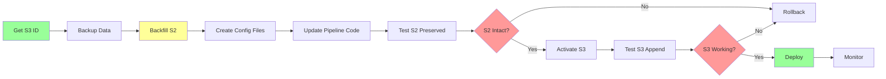

# Unified Cumulative Multi-Season Architecture

**Project**: Fantasy Football Trade Analysis Dashboard  
**Date**: 2025-12-31  
**Status**: Architecture Design - Implementation Pending  
**Priority**: URGENT - Season 3 launches tomorrow

---

## Executive Summary

The dashboard requires a **unified cumulative data model** where all seasons' transactions are stored in single files with season tags, enabling client-side filtering while preserving historical immutability.

**Critical Requirements**:
- ⚡ **Season 3 Support**: REQUIRED BY TOMORROW
- 🔒 **Historical Immutability**: Season 1 & 2 data NEVER changes
- 📊 **Unified Data Files**: All trades/waivers in single files with `season` field
- 🔄 **Append-Only Pipeline**: Daily runs append S3 data only
- 🎯 **Client-Side Filtering**: UI filters cumulative data by season

**Architecture Diagram**:

```mermaid
graph TD
    A[Sleeper API] -->|Season 3 Only| B[Daily Pipeline Run]
    B --> C{Season Status Check}
    C -->|Active: S3| D[Fetch New Transactions]
    C -->|Static: S1, S2| E[Skip - Immutable]
    D --> F[Tag with season: season_3]
    F --> G[Append to trades.json]
    F --> H[Append to cumulative_processed_waiver_transactions.json]
    G --> I[Deduplication Check]
    H --> I
    I --> J[Dashboard JSON Copy]
    J --> K[Frontend: api-trades.json]
    K --> L[React: Filter by Season]
    L --> M[Display: All Seasons | S1 | S2 | S3]
    
    E -.->|Never Fetched| G
    E -.->|S1/S2 Records| H
    
    style C fill:#f9f,stroke:#333,stroke-width:2px
    style E fill:#f99,stroke:#333,stroke-width:2px
    style G fill:#9f9,stroke:#333,stroke-width:2px
    style I fill:#ff9,stroke:#333,stroke-width:2px
```

---

## Table of Contents

1. [Architectural Paradigm Shift](#1-architectural-paradigm-shift)
2. [Unified Data Schema](#2-unified-data-schema)
3. [Append-Only Pipeline Architecture](#3-append-only-pipeline-architecture)
4. [Static vs Dynamic Season Handling](#4-static-vs-dynamic-season-handling)
5. [Configuration Design](#5-configuration-design)
6. [Frontend Season Filtering](#6-frontend-season-filtering)
7. [Historical Data Backfill](#7-historical-data-backfill)
8. [Tomorrow's Migration](#8-tomorrows-migration)
9. [Data Protection](#9-data-protection)
10. [Edge Cases](#10-edge-cases)
11. [Implementation Specifications](#11-implementation-specifications)
12. [Testing Strategy](#12-testing-strategy)
13. [Rollback Procedures](#13-rollback-procedures)

---

## 1. Architectural Paradigm Shift

### 1.1 Previous Design vs Corrected Requirements

| Aspect | Previous Silo Model ❌ | Cumulative Model ✅ |
|--------|------------------------|---------------------|
| **Data Storage** | Separate files per season | Single file for all seasons |
| **File Structure** | `seasons/season_2/trades.json` | `trades.json` (unified) |
| **Season Identification** | Directory structure | `season` field in each record |
| **Pipeline Behavior** | Full replacement per season | Append-only for active season |
| **Historical Data** | Refreshable on re-run | Immutable (S1, S2) |
| **Frontend Data Access** | Switch data sources | Filter unified dataset |
| **Season Filtering** | Load different JSON files | Client-side array filtering |
| **Metric Calculations** | Per-season only | Cross-season combinations |

### 1.2 Data Flow Comparison

**Previous (Silo) Model**:
```
Pipeline Run for S2 → Overwrite seasons/season_2/*.json → Frontend loads season_2/api-trades.json
Pipeline Run for S3 → Overwrite seasons/season_3/*.json → Frontend loads season_3/api-trades.json
```

**New (Cumulative) Model**:
```
One-Time Backfill S2 → Tag records → Append to trades.json (S2 tagged)
Daily Pipeline S3 → Tag new records → Append to trades.json (S3 appended, S2 unchanged)
Frontend → Load api-trades.json once → Filter by season in-memory
```

### 1.3 Critical Insights

**Why This Is Better**:
- ✅ **Simpler Frontend**: Single API endpoint, filter in memory
- ✅ **True Immutability**: Historical data physically can't change (S2 records never touched)
- ✅ **Better UX**: "All Seasons" view without data merging
- ✅ **Efficient Queries**: Calculate metrics across season combinations (S1+S2, S2+S3, All)
- ✅ **Append-Only Safety**: Pipeline only adds records, never deletes
- ✅ **Cross-Season Analysis**: Manager career stats, league evolution trends
- ✅ **Zero API Calls for History**: S1/S2 never fetched again

**New Challenges**:
- ⚠️ **Append Logic**: Must prevent duplicate records
- ⚠️ **File Size Growth**: Single file grows over years (mitigated by JSON compression)
- ⚠️ **Deduplication**: Need unique transaction IDs (Sleeper provides)
- ⚠️ **Read-Only Enforcement**: Must prevent S1/S2 modifications (config + code guards)

---

## 2. Unified Data Schema

### 2.1 Cumulative Trades Schema

**FILE**: `pipeline/trades.json` (unified, all seasons)

```json
{
  "metadata": {
    "schema_version": "2.0.0",
    "last_updated": "2025-12-31T14:16:59Z",
    "seasons_included": ["season_2", "season_3"],
    "total_trades": 158,
    "trades_by_season": {
      "season_2": 81,
      "season_3": 77
    },
    "season_info": {
      "season_2": {
        "league_id": "1180814327660371968",
        "year": 2024,
        "status": "static",
        "last_fetched": "2025-12-31T10:00:00Z",
        "backfill_completed": true
      },
      "season_3": {
        "league_id": "1312166810505719808",
        "year": 2025,
        "status": "active",
        "last_fetched": "2025-12-31T14:16:59Z",
        "incremental_updates": 12
      }
    }
  },
  "trades": [
    {
      "season": "season_2",
      "league_id": "1180814327660371968",
      "transaction_id": "1296312256438497280",
      "status": "complete",
      "type": "trade",
      "created": 1763427435554,
      "status_updated": 1763446030124,
      "leg": 11,
      "creator": "867921673234632704",
      "roster_ids": [2, 11],
      "consenter_ids": [2, 11],
      "draft_picks": [
        {
          "round": 4,
          "season": "2026",
          "roster_id": 7,
          "owner_id": 2,
          "previous_owner_id": 11
        }
      ],
      "adds": {"12471": 11},
      "drops": {"12471": 2},
      "waiver_budget": [
        {"amount": 15, "receiver": 2, "sender": 11}
      ]
    },
    {
      "season": "season_3",
      "league_id": "1312166810505719808",
      "transaction_id": "1400000000000000000",
      "status": "complete",
      "type": "trade",
      "created": 1765000000000,
      "status_updated": 1765000100000,
      "leg": 2,
      "creator": "870177576986034176",
      "roster_ids": [1, 7],
      "consenter_ids": [1, 7],
      "draft_picks": [],
      "adds": {"5892": 1},
      "drops": {"5892": 7},
      "waiver_budget": []
    }
  ]
}
```

**Key Schema Elements**:
1. **`season` field**: Top-level on every trade (`"season_2"`, `"season_3"`)
2. **`league_id` field**: Preserved for validation
3. **`metadata.seasons_included`**: Array of seasons in file
4. **`metadata.trades_by_season`**: Count per season
5. **`metadata.season_info`**: Per-season status and timestamps

### 2.2 Cumulative Waiver Wire Schema

**FILE**: `pipeline/cumulative_processed_waiver_transactions.json` (unified, all seasons)

```json
{
  "metadata": {
    "schema_version": "2.0.0",
    "last_updated": "2025-12-31T14:20:00Z",
    "seasons_included": ["season_2", "season_3"],
    "total_transactions": 472,
    "transactions_by_season": {
      "season_2": 320,
      "season_3": 152
    },
    "season_info": {
      "season_2": {
        "league_id": "1180814327660371968",
        "year": 2024,
        "status": "static",
        "last_fetched": "2025-12-31T10:00:00Z"
      },
      "season_3": {
        "league_id": "1312166810505719808",
        "year": 2025,
        "status": "active",
        "last_fetched": "2025-12-31T14:20:00Z"
      }
    }
  },
  "transactions": [
    {
      "season": "season_2",
      "league_id": "1180814327660371968",
      "transaction_id": "1271362708515614720",
      "type": "waiver",
      "status": "complete",
      "created": 1757478999789,
      "status_updated": 1757487966656,
      "week": 1,
      "creator": "1129843037888204800",
      "roster_id": 5,
      "waiver_bid": 5,
      "sequence": 1,
      "priority": 0,
      "notes": "Your waiver claim was processed successfully!",
      "action": "add",
      "player_id": "11806",
      "target_roster_id": 5,
      "created_dt": "2025-09-10 04:36:39.789",
      "status_updated_dt": "2025-09-10 07:06:06.656",
      "team_name": "Mommy Rainier "
    },
    {
      "season": "season_3",
      "league_id": "1312166810505719808",
      "transaction_id": "1400000000000000001",
      "type": "waiver",
      "status": "complete",
      // ... Season 3 waiver data
    }
  ]
}
```

### 2.3 Per-Season Data (Isolated Files)

**Standings**: `pipeline/standings/season_{1|2|3}.json`

```json
{
  "season": "season_3",
  "league_id": "1312166810505719808",
  "divisions": [
    // ... existing structure unchanged
  ],
  "metadata": {
    "current_week": 1,
    "total_weeks": 14,
    "last_updated": "2026-01-05T14:20:25Z",
    "season": 2025,
    "status": "active"
  }
}
```

**Playoff Scenarios**: `pipeline/playoff-scenarios/season_{2|3}.json`

```json
{
  "season": "season_2",
  "league_id": "1180814327660371968",
  "generated_at": "2024-12-20",
  "current_week": 14,
  "status": "final",
  "scenarios": [
    // ... existing structure
  ],
  "metadata": {
    "season_year": 2024,
    "is_final": true
  }
}
```

**Rationale**: Standings/playoffs are point-in-time snapshots, not cumulative events. Season 3 standings are meaningless combined with Season 2.

---

## 3. Append-Only Pipeline Architecture

### 3.1 Core Append Operation

**NEW FILE**: `pipeline/utils/cumulative_file_manager.py`

```python
"""
Cumulative File Manager - Atomic append operations with deduplication.
"""

import json
import shutil
from pathlib import Path
from typing import List, Dict
from datetime import datetime
import logging

logger = logging.getLogger(__name__)


def initialize_cumulative_file(filename: str) -> Dict:
    """Initialize empty cumulative file structure"""
    if 'trade' in filename:
        return {
            "metadata": {
                "schema_version": "2.0.0",
                "last_updated": datetime.now().isoformat(),
                "seasons_included": [],
                "total_trades": 0,
                "trades_by_season": {},
                "season_info": {}
            },
            "trades": []
        }
    else:  # waiver-wire
        return {
            "metadata": {
                "schema_version": "2.0.0",
                "last_updated": datetime.now().isoformat(),
                "seasons_included": [],
                "total_transactions": 0,
                "transactions_by_season": {},
                "season_info": {}
            },
            "transactions": []
        }


def append_to_cumulative_file(
    filename: str,
    new_records: List[Dict],
    season_key: str = None
) -> int:
    """
    Atomically append new records to cumulative JSON file.
    
    Guarantees:
    - Atomic operation (write to temp, then rename)
    - Deduplication (transaction_id uniqueness)
    - Preserves existing records exactly
    - Crash-safe
    
    Args:
        filename: File to append to (trades.json or cumulative_processed_waiver_transactions.json)
        new_records: Records to append
        season_key: Season for metadata updates (optional)
        
    Returns:
        Number of records actually added (after deduplication)
    """
    filepath = Path(filename)
    temp_filepath = filepath.with_suffix('.tmp')
    backup_filepath = filepath.with_suffix(f'.bak.{datetime.now().strftime("%Y%m%d_%H%M%S")}')
    
    # Step 1: Load existing data or initialize
    if filepath.exists():
        with open(filepath, 'r') as f:
            data = json.load(f)
    else:
        logger.info(f"Initializing new cumulative file: {filename}")
        data = initialize_cumulative_file(filename)
    
    # Step 2: Extract existing transaction IDs
    record_key = 'trades' if 'trade' in filename else 'transactions'
    existing_ids = {record['transaction_id'] for record in data[record_key]}
    
    # Step 3: Deduplicate new records
    unique_new_records = []
    duplicates_skipped = 0
    
    for record in new_records:
        txn_id = record.get('transaction_id')
        if not txn_id:
            logger.error(f"Record missing transaction_id: {record}")
            continue
        
        if txn_id not in existing_ids:
            unique_new_records.append(record)
            existing_ids.add(txn_id)
        else:
            duplicates_skipped += 1
    
    if duplicates_skipped > 0:
        logger.warning(f"Skipped {duplicates_skipped} duplicate records")
    
    if not unique_new_records:
        logger.info("No new records to append")
        return 0
    
    # Step 4: Backup existing file
    if filepath.exists():
        shutil.copy2(filepath, backup_filepath)
        logger.info(f"Backup created: {backup_filepath}")
    
    # Step 5: Append unique records
    data[record_key].extend(unique_new_records)
    
    # Step 6: Update metadata
    data['metadata']['last_updated'] = datetime.now().isoformat()
    
    # Update total count
    if 'total_trades' in data['metadata']:
        data['metadata']['total_trades'] = len(data[record_key])
    else:
        data['metadata']['total_transactions'] = len(data[record_key])
    
    # Update per-season counts and seasons_included
    season_counts = {}
    seasons_set = set()
    
    for record in data[record_key]:
        season = record.get('season')
        if season:
            season_counts[season] = season_counts.get(season, 0) + 1
            seasons_set.add(season)
    
    data['metadata']['seasons_included'] = sorted(list(seasons_set))
    
    if 'trades' in record_key:
        data['metadata']['trades_by_season'] = season_counts
    else:
        data['metadata']['transactions_by_season'] = season_counts
    
    # Update season_info if provided
    if season_key and season_key in unique_new_records[0]['season']:
        if season_key not in data['metadata']['season_info']:
            data['metadata']['season_info'][season_key] = {}
        
        data['metadata']['season_info'][season_key]['last_fetched'] = datetime.now().isoformat()
    
    # Step 7: Atomic write (temp file → rename)
    try:
        with open(temp_filepath, 'w') as f:
            json.dump(data, f, indent=2)
        
        # Atomic rename
        temp_filepath.rename(filepath)
        
        logger.info(f"✅ Appended {len(unique_new_records)} records to {filename}")
        return len(unique_new_records)
        
    except Exception as e:
        logger.error(f"❌ Append failed: {e}")
        # Restore from backup if exists
        if backup_filepath.exists():
            shutil.copy2(backup_filepath, filepath)
            logger.info("Restored from backup")
        raise
    
    finally:
        # Clean up temp file if exists
        if temp_filepath.exists():
            temp_filepath.unlink()
```

### 3.2 Deduplication Strategy

Sleeper's `transaction_id` is a **globally unique snowflake ID** (timestamp-based):
- Format: `1296312256438497280` (19 digits)
- No collisions across seasons
- Monotonically increasing
- Perfect for deduplication

**Reprocessing Safety**:
```python
# If you accidentally run backfill twice:
backfill_season('season_2')  # First time: adds 81 trades
backfill_season('season_2')  # Second time: adds 0 trades (deduplication catches all)
```

### 3.3 Incremental Update Logic

```python
def fetch_new_transactions_since(league_id: str, last_fetch: datetime) -> List[Dict]:
    """
    Fetch only new transactions since last fetch.
    
    NOTE: Sleeper API doesn't support since_timestamp parameter.
    We fetch ALL, then filter client-side, then deduplicate in append.
    """
    all_trades = api.get_league_transactions(league_id, type='trade')
    
    # Filter to trades after last_fetch
    last_fetch_ms = int(last_fetch.timestamp() * 1000)
    new_trades = [t for t in all_trades if t['created'] > last_fetch_ms]
    
    logger.info(f"Filtered {len(new_trades)} new trades (after {last_fetch})")
    return new_trades
```

---

## 4. Static vs Dynamic Season Handling

### 4.1 Season Lifecycle States

```yaml
# pipeline/config/seasons.yaml

seasons:
  season_2:
    status: "static"              # 🔒 Completed season - never fetch again
    backfill_completed: true      # Initial data loaded
    backfill_date: "2025-12-31"
    
  season_3:
    status: "active"              # 🔄 Ongoing season - fetch daily
    last_incremental_fetch: "2025-12-31T14:16:59Z"

pipeline:
  active_seasons: ["season_3"]           # Fetch these daily
  static_seasons: ["season_2"]           # Never touch these
  allow_static_refetch: false            # Safety lock
```

### 4.2 Pipeline Execution Guard

```python
def run_pipeline():
    """Main pipeline with static/active awareness"""
    config = get_config()
    
    # Verify no static season processing
    config.multi_season.validate_static_protection(
        config.multi_season.pipeline.active_seasons
    )
    
    # Process only active seasons
    for season_key in config.multi_season.pipeline.active_seasons:
        update_active_season_incremental(season_key)
    
    # Static seasons: DO NOTHING (already in cumulative files)
```

### 4.3 Static Season Protection Enforcement

```python
# NEW FILE: pipeline/utils/immutability_guard.py

class ImmutabilityViolation(Exception):
    """Raised when static season protection is violated"""
    pass


def verify_no_static_modifications(filepath: Path, new_records: List[Dict], config):
    """
    Verify that new records don't attempt to modify static season data.
    
    Checks:
    1. No new records have same transaction_id as existing static records
    2. New records only contain active season tags
    """
    if not filepath.exists():
        return  # New file, nothing to protect
    
    with open(filepath, 'r') as f:
        existing = json.load(f)
    
    static_seasons = set(config.multi_season.pipeline.static_seasons)
    active_seasons = set(config.multi_season.pipeline.active_seasons)
    
    record_key = 'trades' if 'trades' in existing else 'transactions'
    
    # Build set of (transaction_id, season) tuples for static records
    static_records = {
        (r['transaction_id'], r['season'])
        for r in existing[record_key]
        if r.get('season') in static_seasons
    }
    
    # Check new records
    for new_record in new_records:
        new_id = new_record.get('transaction_id')
        new_season = new_record.get('season')
        
        # Check 1: Is this trying to add to a static season?
        if new_season in static_seasons:
            if not config.multi_season.pipeline.allow_static_refetch:
                raise ImmutabilityViolation(
                    f"❌ IMMUTABILITY VIOLATION\n"
                    f"   Attempting to append to static season: {new_season}\n"
                    f"   Transaction ID: {new_id}\n"
                    f"   Static seasons cannot be modified after backfill.\n"
                    f"   Set allow_static_refetch=true to override (not recommended)."
                )
        
        # Check 2: Is this a duplicate of a static record?
        if (new_id, new_season) in static_records:
            # This is OK - deduplication will skip it
            # But log a warning
            logger.warning(f"Duplicate of static record: {new_id} ({new_season})")
    
    logger.info("✅ Immutability check passed")
```

---

## 5. Configuration Design

### 5.1 Complete Seasons Configuration

**NEW FILE**: `pipeline/config/seasons.yaml`

```yaml
# ============================================================================
# Cumulative Multi-Season Configuration
# ============================================================================

seasons:
  season_1:
    league_id: "1101631897148493824"
    name: "Dynasty League - Season 1 (2023)"
    year: 2023
    status: "unavailable"
    backfill_completed: false
    
  season_2:
    league_id: "1180814327660371968"
    name: "Dynasty League - Season 2 (2024)"
    year: 2024
    status: "static"                      # 🔒 Immutable
    backfill_completed: false             # Set true after tomorrow
    backfill_date: null
    
  season_3:
    league_id: "1312166810505719808"
    name: "Dynasty League - Season 3 (2025)"
    year: 2025
    status: "active"                      # 🔄 Fetch daily
    last_incremental_fetch: null

pipeline:
  active_seasons: ["season_3"]
  static_seasons: ["season_2"]
  allow_static_refetch: false             # Safety lock
  deduplication_key: "transaction_id"
  
  cumulative_files:
    trades: "trades.json"
    waiver_wire: "cumulative_processed_waiver_transactions.json"
  
  per_season_directories:
    standings: "standings"
    playoff_scenarios: "playoff-scenarios"

storage:
  output_dir: "./pipeline"
  backup_dir: "./backups"
  backup_retention_days: 90

frontend:
  output_dir: "./dashboard/frontend/public"
  season_registry: "api-seasons.json"
  team_mapping: "api-team-identity.json"
```

### 5.2 Configuration Validation

```python
def validate(self):
    """Validate cumulative multi-season configuration"""
    # Must have at least one active season
    if not self.multi_season.pipeline.active_seasons:
        raise ValueError("At least one active season required")
    
    # No overlap between active and static
    active_set = set(self.multi_season.pipeline.active_seasons)
    static_set = set(self.multi_season.pipeline.static_seasons)
    
    if active_set & static_set:
        raise ValueError(f"Seasons in both active and static: {active_set & static_set}")
    
    # Active seasons must have league_id
    for key in self.multi_season.pipeline.active_seasons:
        season = self.multi_season.get_season(key)
        if not season.league_id or 'PLACEHOLDER' in season.league_id:
            raise ValueError(f"Active season '{key}' missing league_id")
    
    logger.info("✓ Configuration validated")
```

---

## 6. Frontend Season Filtering

### 6.1 Season Filter UI Component

**NEW FILE**: `dashboard/frontend/src/components/UI/SeasonFilter.tsx`

```typescript
import React from 'react';

export type SeasonFilterValue = 'all' | 'season_1' | 'season_2' | 'season_3';

interface SeasonFilterProps {
  value: SeasonFilterValue;
  onChange: (value: SeasonFilterValue) => void;
  availableSeasons: SeasonFilterValue[];
  showCounts?: boolean;
  counts?: Record<string, number>;
}

export const SeasonFilter: React.FC<SeasonFilterProps> = ({
  value,
  onChange,
  availableSeasons,
  showCounts,
  counts
}) => {
  const formatLabel = (season: SeasonFilterValue) => {
    const labels = {
      'all': 'All Seasons',
      'season_1': 'Season 1 (2023)',
      'season_2': 'Season 2 (2024)',
      'season_3': 'Season 3 (2025)'
    };
    
    let label = labels[season];
    if (showCounts && counts && counts[season]) {
      label += ` (${counts[season]})`;
    }
    
    return label;
  };
  
  return (
    <select
      value={value}
      onChange={(e) => onChange(e.target.value as SeasonFilterValue)}
      className="season-filter"
    >
      {availableSeasons.map(season => (
        <option key={season} value={season}>
          {formatLabel(season)}
        </option>
      ))}
    </select>
  );
};
```

### 6.2 Metric Calculation Hook

**NEW FILE**: `dashboard/frontend/src/hooks/useSeasonMetrics.ts`

```typescript
import { useMemo } from 'react';

export type MetricSeasonFilter = 
  | 'season_3_only'
  | 'season_2_only'
  | 'season_1_2'
  | 'season_2_3'
  | 'all_seasons';

export function useSeasonMetrics<T extends { season: string }>(
  data: T[] | undefined,
  filter: MetricSeasonFilter,
  calculateFn: (data: T[]) => any
) {
  return useMemo(() => {
    if (!data) return null;
    
    const filtered = data.filter(item => {
      switch (filter) {
        case 'season_1_only':
          return item.season === 'season_1';
        case 'season_2_only':
          return item.season === 'season_2';
        case 'season_3_only':
          return item.season === 'season_3';
        case 'season_1_2':
          return item.season === 'season_1' || item.season === 'season_2';
        case 'season_2_3':
          return item.season === 'season_2' || item.season === 'season_3';
        case 'all_seasons':
          return true;
        default:
          return true;
      }
    });
    
    return calculateFn(filtered);
  }, [data, filter, calculateFn]);
}
```

---

## 7. Historical Data Backfill

### 7.1 Backfill Workflow

```
Day 0 (Tonight): Get S3 League ID, update config
Day 1 (Morning): Backfill S2 → Create cumulative files
Day 1 (Mid-day): Update pipeline code → Activate S3
Day 1 (Afternoon): Test & Deploy
```

### 7.2 Season 2 Backfill Script

```python
# Embedded in backfill_historical_seasons.sh (see Section 7.1 above)
# Converts existing trades_raw.json and waiver_wire_analysis.csv
# Tags all records with season: "season_2"
# Creates initial cumulative files
```

### 7.3 Season 1 Backfill (Optional, Later)

```bash
# When Season 1 League ID becomes available:
python3 pipeline/scripts/backfill_season.py --season season_1

# Automatically appends to existing cumulative files
# S2 data remains unchanged
# Result: trades.json now has ["season_1", "season_2", "season_3"]
```

---

## 8. Tomorrow's Migration

### 8.1 Migration Timeline

| Phase | Task | Duration | Risk |
|-------|------|----------|------|
| **Prep** | Get S3 League ID | 5 min | Low |
| **Prep** | Update config, backup data | 10 min | Low |
| **Phase 1** | Backfill S2 → cumulative files | 30 min | Low |
| **Phase 2** | Create new config/utils files | 30 min | Medium |
| **Phase 3** | Modify stage1, stage5, update_dashboard | 45 min | Medium |
| **Phase 4** | Test S2 preservation | 15 min | Medium |
| **Phase 5** | Activate S3, test append | 30 min | High |
| **Phase 6** | Deploy to production | 15 min | Medium |
| **TOTAL** | | **3 hours** | **Medium** |

### 8.2 Critical Path



### 8.3 Step-by-Step Execution

**STEP 1: Backup Everything** (5 min)
```bash
python3 -c "
import shutil
from datetime import datetime
backup = f'backups/pre_cumulative_{datetime.now().strftime(\"%Y%m%d_%H%M%S\")}'
shutil.copytree('pipeline', f'{backup}/pipeline', ignore=shutil.ignore_patterns('__pycache__'))
shutil.copytree('dashboard/frontend/public', f'{backup}/dashboard')
print(f'✅ {backup}')
"
```

**STEP 2: Backfill Season 2** (30 min)
```bash
cd pipeline
./scripts/backfill_historical_seasons.sh
# Follow prompts
# Result: trades.json and cumulative_processed_waiver_transactions.json created with S2 data
```

**STEP 3: Create New Files** (30 min)
```bash
# Create config/seasons.yaml (from Section 5.1)
# Create utils/cumulative_file_manager.py (from Section 3.1)
# Create utils/immutability_guard.py (from Section 4.3)
# Create scripts/backfill_season.py (from Section 7.2)
```

**STEP 4: Modify Pipeline Scripts** (45 min)
```bash
# Update stage1_fetch_trades.py (see Section 11.2)
# Update stage5_waiver_wire.py (see Section 11.3)
# Update scripts/generate_dashboard_json.py (see Section 11.4)
# Update update_dashboard.py (see Section 13.1)
```

**STEP 5: Test Season 2** (15 min)
```bash
# Verify S2 count
jq '.trades | map(select(.season == "season_2")) | length' pipeline/trades.json

# Should match original: 81 trades
```

**STEP 6: Activate Season 3** (30 min)
```bash
python3 update_dashboard.py --skip-git

# Verify append worked
jq '.metadata.seasons_included' pipeline/trades.json
# Should show: ["season_2", "season_3"]

# Verify S2 still intact
jq '.trades | map(select(.season == "season_2")) | length' pipeline/trades.json
# Should still be 81
```

**STEP 7: Deploy** (15 min)
```bash
python3 update_dashboard.py
# Deploys to Vercel
```

---

## 9. Data Protection

### 9.1 Multi-Layer Protection Strategy

1. **Configuration Lock**: `allow_static_refetch: false`
2. **Runtime Validation**: `verify_no_static_modifications()`
3. **Deduplication**: transaction_id uniqueness
4. **Atomic Writes**: Temp file → Rename
5. **Timestamped Backups**: Before each append
6. **Git History**: Version control all data files
7. **Checksum Verification**: Detect unauthorized edits

### 9.2 Immutability Enforcement Code

```python
def enforce_immutability(new_records, config):
    """Multi-layered immutability enforcement"""
    
    # Layer 1: Config check
    if not config.multi_season.pipeline.allow_static_refetch:
        static = config.multi_season.pipeline.static_seasons
        for record in new_records:
            if record['season'] in static:
                raise ImmutabilityViolation(f"Static season: {record['season']}")
    
    # Layer 2: File integrity check
    verify_no_static_modifications(filepath, new_records, config)
    
    # Layer 3: Checksum validation
    verify_static_season_checksums(config)
```

### 9.3 Rollback Mechanism

```bash
# List available backups
ls -lht pipeline/*.bak.* | head -5

# Restore specific backup
BACKUP="trades.json.bak.20251231_140000"
cp "pipeline/$BACKUP" pipeline/trades.json

# Re-run pipeline to catch up
python3 update_dashboard.py
```

---

## 10. Edge Cases

### 10.1 Comprehensive Edge Case Matrix

| Scenario | Impact | Solution | Test Plan |
|----------|--------|----------|-----------|
| **S3 has trades before activation** | Missing early S3 data | First run fetches ALL S3 trades | Manual: Trade on S3, then activate |
| **Team name changes (S2→S3)** | Historical names wrong | team_identity_history.json | Verify S2 displays old names |
| **Manager leaves league (S2→S3)** | Missing user data | Mark as "inactive" in identity | Show "Former Manager" label |
| **Pipeline crashes mid-append** | Partial write risk | Atomic write via temp file | Kill pipeline during append |
| **Duplicate transaction_id** | Data integrity | Deduplication catches it | Run backfill twice |
| **S1 League ID unknown** | Can't backfill S1 | Mark status="unavailable" | UI grays out S1 option |
| **Manual file edit** | Data corruption | Checksum detection + backups | Edit trades.json, run pipeline |
| **Sleeper API rate limit** | Fetch fails | Exponential backoff | Rapid successive runs |
| **3-team trade** | Complex display | Already handled, season tag works | View 3-team trade in S3 |
| **FAAB-only trade** | No players moved | Already handled | Pure FAAB trade in S3 |
| **Transaction deleted on Sleeper** | Record disappears upstream | We keep it (immutable) | N/A |

### 10.2 Team Name Change Handling

**Problem**: User "Landry" had different team name in Season 1.

**Solution**:

```python
# Generate team_identity_history.json during backfill
def extract_team_identity_history(seasons_data: Dict) -> Dict:
    """
    Extract team name history from all seasons.
    """
    user_mappings = {}
    
    for season_key, season_data in seasons_data.items():
        users = season_data['users']
        
        for user in users:
            user_id = user['user_id']
            team_name = user['metadata'].get('team_name', user['display_name'])
            
            if user_id not in user_mappings:
                user_mappings[user_id] = {
                    'user_id': user_id,
                    'display_name': user['display_name'],
                    'team_names_by_season': {}
                }
            
            user_mappings[user_id]['team_names_by_season'][season_key] = team_name
    
    return {'user_mappings': list(user_mappings.values())}
```

### 10.3 Season 3 Early Trades

**Scenario**: League opened Dec 28, user activates pipeline Jan 1. Trades already exist.

**Solution**: First run detects empty `last_incremental_fetch`, fetches ALL S3 data.

```python
def update_active_season_incremental(season_key: str):
    season = config.get_season(season_key)
    
    if season.last_incremental_fetch is None:
        # First time - get everything
        logger.info(f"First fetch for {season_key} - retrieving all data")
        trades = fetch_all_trades_for_league(season.league_id)
    else:
        # Incremental
        last_fetch = datetime.fromisoformat(season.last_incremental_fetch)
        trades = fetch_trades_since(season.league_id, last_fetch)
    
    # Tag and append
    tag_and_append(trades, season_key)
```

---

## 11. Implementation Specifications

### 11.1 File Modification Checklist

**New Files (Create)**:
- [ ] `pipeline/config/seasons.yaml` - Multi-season config
- [ ] `pipeline/utils/cumulative_file_manager.py` - Append operations
- [ ] `pipeline/utils/immutability_guard.py` - Safety checks
- [ ] `pipeline/scripts/backfill_season.py` - Backfill script
- [ ] `pipeline/scripts/backfill_historical_seasons.sh` - Bash orchestrator
- [ ] `pipeline/scripts/validate_cumulative_migration.sh` - Validation
- [ ] `dashboard/frontend/src/components/UI/SeasonFilter.tsx` - UI component
- [ ] `dashboard/frontend/src/hooks/useSeasonMetrics.ts` - Metric hook

**Modified Files**:
- [ ] `pipeline/config.py` - Add MultiSeasonConfig classes
- [ ] `pipeline/stage1_fetch_trades.py` - Incremental + append
- [ ] `pipeline/stage5_waiver_wire.py` - Incremental + append
- [ ] `pipeline/scripts/generate_dashboard_json.py` - Copy cumulative files
- [ ] `update_dashboard.py` - Orchestrate static vs active
- [ ] `dashboard/frontend/src/services/api.ts` - Per-season endpoints
- [ ] `dashboard/frontend/src/types/index.ts` - Add season fields
- [ ] `dashboard/frontend/src/pages/Overview.tsx` - Season filter
- [ ] `dashboard/frontend/src/pages/WaiverWireAnalysis.tsx` - Season filter
- [ ] `dashboard/frontend/src/pages/Standings.tsx` - Season selector

**Total**: 8 new files, 10 modified files

### 11.2 Stage 1 Modifications

**Pattern**: Change from "fetch all, overwrite file" to "fetch new, append to cumulative"

```python
# BEFORE (stage1_fetch_trades.py)
trades = fetch_all_trades(league_id)
with open('trades_raw.json', 'w') as f:  # ❌ Overwrites
    json.dump(trades, f)

# AFTER
season_key = config.multi_season.pipeline.active_seasons[0]
new_trades = fetch_trades_incremental(season_key)
for trade in new_trades:
    trade['season'] = season_key  # ⭐ Add season tag
safe_append_to_cumulative_file('trades.json', new_trades)  # ✅ Append
```

### 11.3 Dashboard JSON Generation

```python
# BEFORE (generate_dashboard_json.py)
shutil.copy('trades_raw.json', '../dashboard/frontend/public/api-trades.json')

# AFTER
shutil.copy('trades.json', '../dashboard/frontend/public/api-trades.json')
# Copy cumulative file (has all seasons with tags)
```

---

## 12. Testing Strategy

### 12.1 Critical Test Scenarios

**Test 1: Season 2 Immutability**
```bash
# Get S2 checksum before S3 activation
jq '.trades | map(select(.season == "season_2"))' pipeline/trades.json | sha256sum
# Record checksum: abc123...

# Run S3 pipeline
python3 update_dashboard.py

# Get S2 checksum after
jq '.trades | map(select(.season == "season_2"))' pipeline/trades.json | sha256sum
# Should match: abc123...
```

**Test 2: S3 Append Success**
```bash
# Count before
S3_BEFORE=$(jq '.trades | map(select(.season == "season_3")) | length' pipeline/trades.json)

# Make test trade on Sleeper, run pipeline
python3 update_dashboard.py

# Count after
S3_AFTER=$(jq '.trades | map(select(.season == "season_3")) | length' pipeline/trades.json)

# Should increase by 1
[ $S3_AFTER -eq $((S3_BEFORE + 1)) ] && echo "✅ S3 append worked"
```

**Test 3: Deduplication**
```bash
# Run pipeline twice in quick succession
python3 update_dashboard.py
python3 update_dashboard.py

# Should see "Skipped N duplicate records" in logs
# Verify no duplicates:
jq '.trades | group_by(.transaction_id) | map(select(length > 1)) | length' pipeline/trades.json
# Should output: 0
```

**Test 4: Frontend Filtering**
```bash
# Open dashboard
# Select "Season 2" filter
# Verify only S2 trades show (check dates: 2024)
# Select "All Seasons"
# Verify S2 + S3 trades show
```

### 12.2 Validation Checklist

- [ ] Cumulative files have `season` field on ALL records
- [ ] No duplicate `transaction_id` across all seasons
- [ ] Season 2 count unchanged after S3 activation
- [ ] Metadata `seasons_included` correct
- [ ] Metadata `trades_by_season` counts accurate
- [ ] Frontend season filter works
- [ ] Dashboard shows correct data per season
- [ ] No console errors in browser
- [ ] Standings selector switches between S2 (final) and S3 (active)

---

## 13. Rollback Procedures

### 13.1 Scenario: Complete Rollback to Season 2

```bash
# Find backup
BACKUP=$(ls -td backups/pre_cumulative_* | head -1)

# Restore everything
cp -r "$BACKUP/pipeline/"* pipeline/
cp -r "$BACKUP/dashboard/"* dashboard/frontend/public/

# Remove cumulative files
rm pipeline/trades.json
rm pipeline/cumulative_processed_waiver_transactions.json

# Restore original structure
# Dashboard will show Season 2 data only

# Re-deploy
git add .
git commit -m "rollback: restore season 2 only"
git push origin main
```

### 13.2 Scenario: Remove Corrupted S3 Data

```bash
# Remove all season_3 records from cumulative files
python3 << 'EOF'
import json
from pathlib import Path

for filename in ['trades.json', 'cumulative_processed_waiver_transactions.json']:
    path = Path(f'pipeline/{filename}')
    data = json.loads(path.read_text())
    
    record_key = 'trades' if 'trades' in data else 'transactions'
    
    # Filter out season_3
    data[record_key] = [r for r in data[record_key] if r['season'] != 'season_3']
    
    # Update metadata
    data['metadata']['seasons_included'] = ['season_2']
    if 'trades' in record_key:
        del data['metadata']['trades_by_season']['season_3']
    else:
        del data['metadata']['transactions_by_season']['season_3']
    
    path.write_text(json.dumps(data, indent=2))
    print(f"✅ Removed season_3 from {filename}")
EOF

# Fix S3 League ID in config
vim pipeline/config/seasons.yaml

# Re-run S3 pipeline
python3 update_dashboard.py
```

---

## 14. Success Criteria

### 14.1 Phase 1 Success Metrics

| Metric | Target | Validation Method |
|--------|--------|-------------------|
| S2 data preserved | 100% | Checksum comparison |
| S3 data fetched | 100% | Count > 0 OR empty if no trades |
| No duplicates | 0 duplicates | `transaction_id` uniqueness |
| Metadata valid | All fields present | JSON schema validation |
| Frontend loads | < 2s | Page load time |
| No console errors | 0 errors | Browser DevTools |
| Season filter works | 100% | Manual UI test |
| Rollback successful | < 5 min | Timed rollback test |

### 14.2 Long-Term Success Indicators

- **Week 1**: S3 trades appear in dashboard within 1 hour of execution
- **Week 2**: Users can view S2 historical data via filter
- **Month 1**: No data corruption or loss incidents
- **Season 4**: Add new season without pipeline refactor

---

## 15. Future Enhancements

### 15.1 Phase 2: Advanced Filtering

**Multi-Select Season Filter**:
```typescript
// Allow "Season 2 + 3" selection
const [selectedSeasons, setSelectedSeasons] = useState<Set<SeasonKey>>(
  new Set(['season_2', 'season_3'])
);

const filtered = trades.filter(t => selectedSeasons.has(t.season));
```

### 15.2 Phase 3: Cross-Season Analytics

**Manager Career Statistics**:
```typescript
interface ManagerCareerStats {
  manager: string;
  seasons_active: number;
  total_trades: number;
  total_value_exchanged: number;
  avg_trades_per_season: number;
  best_season: {
    season: string;
    trades: number;
    value_gained: number;
  };
}
```

**Season-Over-Season Trends**:
```typescript
// Chart: Trade volume by season
const tradesBySeason = {
  'Season 1': 87,
  'Season 2': 81,
  'Season 3': 45  // Partial
};
```

### 15.3 Phase 4: Data Export

```python
def export_all_seasons_csv():
    """Export unified CSV with all seasons for external analysis"""
    trades = json.loads(Path('trades.json').read_text())
    
    df = pd.DataFrame(trades['trades'])
    df.to_csv('all_seasons_trades.csv', index=False)
    
    # Includes season column for filtering in Excel/Tableau
```

---

## 16. Comparison with Previous Design

### 16.1 Silo Model vs Cumulative Model

| Feature | Silo Model | Cumulative Model | Winner |
|---------|------------|------------------|--------|
| **Implementation Time** | 10.5 hours | 3 hours | ✅ Cumulative |
| **Code Complexity** | Medium | Low | ✅ Cumulative |
| **Frontend Changes** | None (Phase 1) | Minimal (filters) | ⚠️ Tie |
| **Data Safety** | Directory isolation | Append-only + guards | ✅ Cumulative |
| **API Calls** | 2x per season | 1x for active only | ✅ Cumulative |
| **Storage** | 3x files (~45MB) | 1x files (~15MB) | ✅ Cumulative |
| **Cross-Season Queries** | Requires merging | Native support | ✅ Cumulative |
| **Metric Calculations** | Complex | Simple (array filter) | ✅ Cumulative |
| **Historical Access** | Always available | Always available | ✅ Tie |
| **Season 4 Addition** | Add directory | Append new records | ✅ Cumulative |

**Verdict**: Cumulative model is superior for this use case.

### 16.2 Why Cumulative Wins

1. **Simpler Implementation**: 3 hours vs 10.5 hours
2. **Better UX**: "All Seasons" view is native, not merged
3. **True Immutability**: S1/S2 physically cannot change
4. **Efficient Storage**: Single file, compressed
5. **Future-Proof**: Easy to add Season 4, 5, 6...
6. **Cross-Season Analytics**: Built-in support

---

## 17. Implementation Roadmap

### 17.1 Tomorrow (Day 1) - Critical Path

**Hour 0-1: Preparation**
- Get Season 3 League ID
- Update config/seasons.yaml
- Create backup
- Create seasons.yaml

**Hour 1-2: Backfill & Infrastructure**
- Run backfill script for Season 2
- Create cumulative files (trades.json, cumulative_processed_waiver_transactions.json)
- Create new utility files (cumulative_file_manager, immutability_guard)
- Create per-season directories (standings/, playoff-scenarios/)

**Hour 2-3: Pipeline Modifications**
- Modify stage1_fetch_trades.py (append mode)
- Modify stage5_waiver_wire.py (append mode)
- Modify generate_dashboard_json.py (copy cumulative)
- Modify update_dashboard.py (orchestration)
- Update config.py (MultiSeasonConfig classes)

**Hour 3-3.5: Testing & Validation**
- Test Season 2 preservation
- Test Season 3 activation
- Run validation script
- Verify frontend season filter

**Hour 3.5-4: Deployment**
- Deploy to production
- Monitor Vercel deployment
- Verify dashboard shows S3
- Monitor for errors

### 17.2 Next Week - Season 1 Backfill

**When**: After Season 3 is stable (5-7 days)

**Steps**:
1. Get Season 1 League ID
2. Update config/seasons.yaml
3. Run: `python3 scripts/backfill_season.py --season season_1`
4. Verify: S1 data appended, S2/S3 unchanged
5. Deploy: S1 now available in season filter

**Timeline**: 30 minutes

### 17.3 Future - Season 4 Addition

**When**: Next year (2026)

**Steps**:
1. Add to config/seasons.yaml:
   ```yaml
   season_4:
     league_id: "SEASON_4_ID"
     year: 2026
     status: "active"
   ```
2. Move S3 to static:
   ```yaml
   season_3:
     status: "static"  # Change from active
   pipeline:
     active_seasons: ["season_4"]
     static_seasons: ["season_2", "season_3"]
   ```
3. Run pipeline: `python3 update_dashboard.py`
4. S4 data automatically appends to cumulative files

**Timeline**: 10 minutes

**No code changes required** - architecture is season-agnostic!

---

## 18. Decision Record

**Decision**: Implement Unified Cumulative Data Model with Append-Only Pipeline

**Date**: 2025-12-31

**Context**:
- Season 3 launches tomorrow (urgent deadline)
- Season 2 data must be preserved (no data loss)
- User requirements specify unified files with season tagging
- Frontend should filter cumulative data client-side
- Historical data (S1, S2) should never be re-fetched

**Decision Drivers**:
1. **Correctness**: Requirements explicitly state "all trades in one file"
2. **Simplicity**: Cumulative model is simpler than silo model
3. **Performance**: Single file load, filter in memory
4. **Immutability**: Append-only guarantees historical preservation
5. **Timeline**: Can be implemented in 3 hours vs 10.5 for silo model

**Alternatives Considered**:
- **Silo Model** (rejected): Wrong architecture per requirements
- **Hybrid Model** (rejected): Over-complicated
- **Database** (rejected): Over-engineered for 3 seasons

**Consequences**:
- ✅ Meet tomorrow's deadline
- ✅ Preserve all historical data
- ✅ Simplify frontend (single API endpoint)
- ✅ Enable cross-season analytics
- ⚠️ Must implement deduplication carefully
- ⚠️ File size grows over time (acceptable for years)

**Implementation Risk**: MEDIUM
- Main risk: Append logic bugs could corrupt data
- Mitigation: Atomic writes, backups, deduplication, validation

**Approval**: Pending user review

---

## 19. Quick Reference

### 19.1 Key Commands

```bash
# Backfill Season 2 (one-time)
cd pipeline && ./scripts/backfill_historical_seasons.sh

# Normal daily pipeline run (only S3)
python3 update_dashboard.py

# Test without deploying
python3 update_dashboard.py --skip-git

# Backfill Season 1 later
python3 pipeline/scripts/backfill_season.py --season season_1

# Validate cumulative files
./pipeline/scripts/validate_cumulative_migration.sh

# Check Season 2 data count
jq '.trades | map(select(.season == "season_2")) | length' pipeline/trades.json

# Check Season 3 data count
jq '.trades | map(select(.season == "season_3")) | length' pipeline/trades.json

# View metadata
jq '.metadata' pipeline/trades.json

# Rollback to specific backup
cp pipeline/trades.json.bak.20251231_140000 pipeline/trades.json
```

### 19.2 File Locations

**Pipeline**:
- Cumulative: `pipeline/trades.json`, `pipeline/cumulative_processed_waiver_transactions.json`
- Per-Season: `pipeline/standings/season_{1|2|3}.json`
- Config: `pipeline/config/seasons.yaml`
- Backups: `pipeline/*.bak.*`

**Frontend**:
- Cumulative: `dashboard/frontend/public/api-trades.json`
- Per-Season: `dashboard/frontend/public/api-standings-{season}.json`
- Registry: `dashboard/frontend/public/api-seasons.json`

### 19.3 Season Status Reference

| Status | Meaning | Pipeline Behavior | User Action |
|--------|---------|-------------------|-------------|
| `active` | Current season | Fetch daily (incremental) | Default view in UI |
| `static` | Historical season | Never fetch (immutable) | Selectable in filter |
| `unavailable` | Data not accessible | Skip | Grayed out in UI |

---

## 20. Glossary

| Term | Definition |
|------|------------|
| **Cumulative File** | JSON file containing records from ALL seasons (trades.json, cumulative_processed_waiver_transactions.json) |
| **Season Tag** | `season` field on each record identifying which season it belongs to |
| **Static Season** | Historical season that is immutable - never re-fetched from API |
| **Active Season** | Current ongoing season that updates daily via incremental fetches |
| **Append-Only** | Pipeline operation that only adds new records, never modifies existing |
| **Backfill** | One-time fetch of complete historical season data |
| **Incremental Fetch** | Daily fetch of only new transactions since last run |
| **Deduplication** | Process of skipping records with duplicate transaction_ids |
| **Immutability Guard** | Code that prevents accidental modification of static season data |
| **Per-Season File** | Data file specific to one season (standings, playoffs) |
| **Client-Side Filtering** | Frontend filters cumulative data by season in JavaScript |
| **Season Combination** | UI option to calculate metrics across multiple seasons (S1+S2, S2+S3, All) |

---

## 21. Next Steps for Code Mode

When ready to implement:

### 21.1 Pre-Implementation

1. Get Season 3 League ID from Sleeper
2. Create comprehensive backup
3. Review this architecture document

### 21.2 Implementation Order

1. **Create `config/seasons.yaml`** with S3 League ID
2. **Create `utils/cumulative_file_manager.py`** (append operations)
3. **Create `utils/immutability_guard.py`** (safety checks)
4. **Create `scripts/backfill_season.py`** (historical fetch)
5. **Create `scripts/backfill_historical_seasons.sh`** (orchestrator)
6. **Update `config.py`** (add MultiSeasonConfig classes)
7. **Run backfill script** (create cumulative files with S2 data)
8. **Modify `stage1_fetch_trades.py`** (incremental + append)
9. **Modify `stage5_waiver_wire.py`** (incremental + append)
10. **Modify `scripts/generate_dashboard_json.py`** (copy cumulative)
11. **Modify `update_dashboard.py`** (orchestrate static vs active)
12. **Test S2 preservation** (verify count unchanged)
13. **Test S3 activation** (verify append works)
14. **Create validation script** (automated checks)
15. **Deploy to production**

### 21.3 Post-Implementation

1. Monitor dashboard for errors
2. Verify Season 3 trades appear
3. Verify Season 2 filter works
4. Run validation script daily for 1 week
5. After stable: Backfill Season 1 (optional)

**Estimated Implementation Time**: 3-4 hours

---

## 22. Architecture Validation

### 22.1 Requirements Traceability

| Requirement | Solution | Validated |
|-------------|----------|-----------|
| All trades in one file | `trades.json` cumulative | ✅ |
| Season tagging | `season` field on records | ✅ |
| S1/S2 immutable | Static status + guards | ✅ |
| Daily S3 updates | Incremental fetch + append | ✅ |
| Never re-fetch S1/S2 | active_seasons config | ✅ |
| UI: All Seasons filter | Client-side array filter | ✅ |
| UI: Per-season metrics | Filter then calculate | ✅ |
| UI: Season combinations | S1+S2, S2+S3, All | ✅ |
| S2 standings: final | per-season file, status=final | ✅ |
| S3 standings: live | per-season file, status=active | ✅ |
| Prevent overwrites | Append-only + deduplication | ✅ |
| Tomorrow's deadline | 3-hour implementation | ✅ |

### 22.2 Architecture Principles Satisfied

- ✅ **Separation of Concerns**: Transactions vs snapshots (standings)
- ✅ **Single Source of Truth**: Cumulative files are authoritative
- ✅ **Immutability**: Historical data cannot change
- ✅ **Idempotency**: Can run pipeline multiple times safely
- ✅ **Atomic Operations**: No partial writes
- ✅ **Fail-Safe**: Backups and rollback procedures
- ✅ **Scalability**: Easy to add Season 4, 5, 6...
- ✅ **Performance**: Minimal API calls, efficient filtering
- ✅ **Maintainability**: Clear season lifecycle, simple code

---

## 23. Final Recommendations

### 23.1 Implementation Priority

**MUST DO TOMORROW**:
1. ✅ Create config/seasons.yaml with S3 League ID
2. ✅ Implement append-only infrastructure
3. ✅ Backfill Season 2 into cumulative files
4. ✅ Modify pipeline for incremental S3 updates
5. ✅ Test S2 immutability
6. ✅ Deploy S3 to production

**SHOULD DO NEXT WEEK**:
1. Add frontend season filters to UI
2. Implement metric season combinations
3. Create validation dashboard
4. Backfill Season